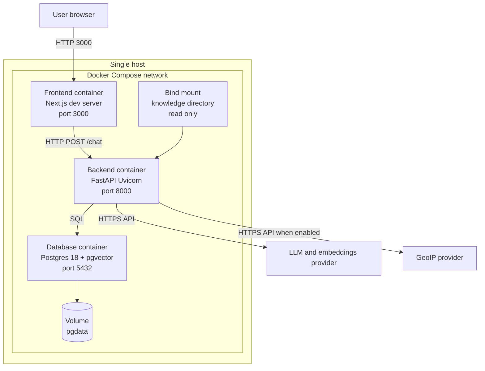
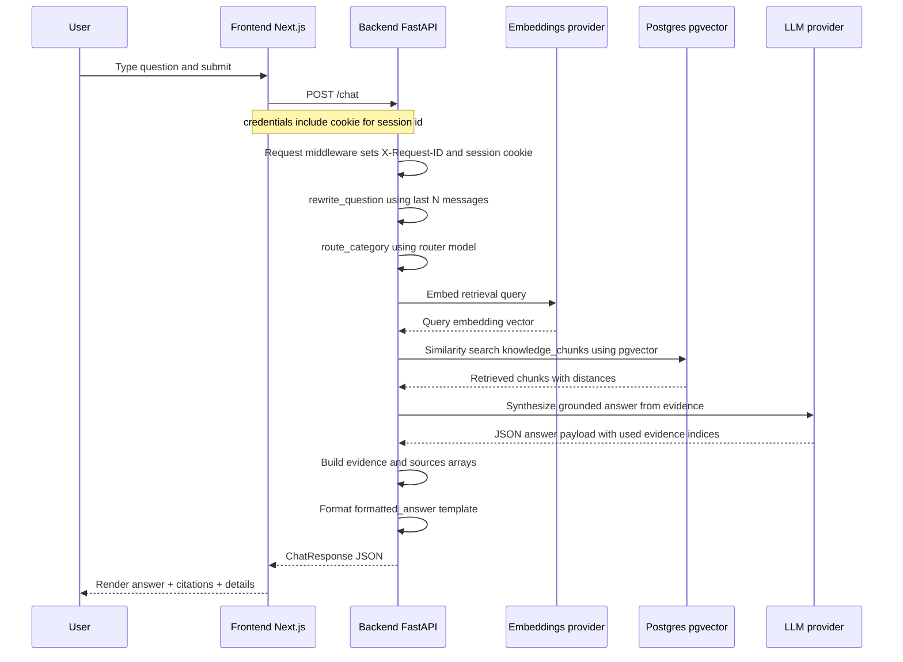
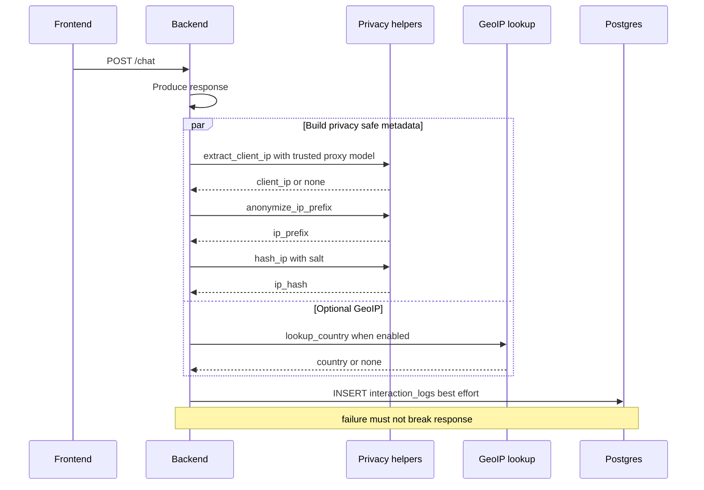
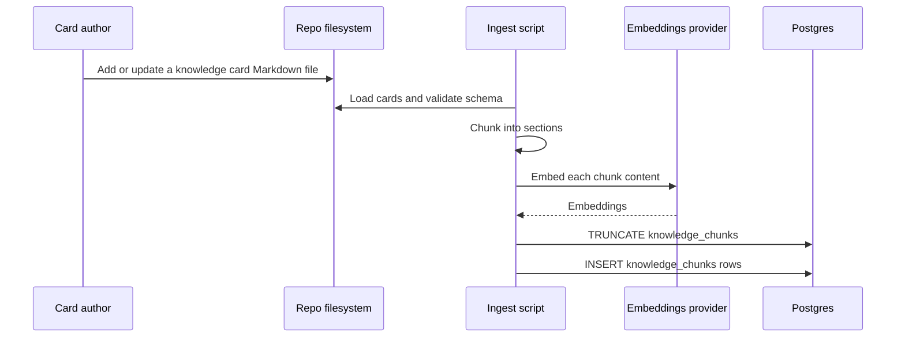

# Ask-about-Piotr — Architecture

Last updated: 2026-02-08

## How to read this document

This is the organization-grade architecture reference for the Ask-about-Piotr repository.

Suggested reading paths:

* **New contributors**: start with [System goals and non-goals](#system-goals-and-non-goals) → [C4 diagrams](#c4-architecture-diagrams) → [Key request flows](#key-request-flows).
* **Operators**: focus on [Deployment architecture](#deployment-architecture) → [Appendix: configuration reference](#appendix-configuration-reference) → [Observability and operations](#observability-and-operations).
* **Security reviewers**: focus on [Security and privacy model](#security-and-privacy-model) → [Data model and retention](#data-model-and-retention) → [Threats and mitigations](#threats-and-mitigations).

Scope:

* This document describes what exists in the repository today and what the code enforces at runtime.
* Where policies are not implemented yet (e.g., data retention enforcement), this document states **TBD** and provides **recommended controls**, clearly marked.

---

## Table of contents

* [System summary](#system-summary)
* [System goals and non-goals](#system-goals-and-non-goals)
* [C4 architecture diagrams](#c4-architecture-diagrams)
  * [C4 Context](#c4-context)
  * [C4 Container](#c4-container)
  * [C4 Component — backend](#c4-component--backend)
* [Deployment architecture](#deployment-architecture)
* [Key request flows](#key-request-flows)
  * [Chat request: question → retrieval → LLM → answer](#chat-request-question--retrieval--llm--answer)
  * [Privacy-first interaction logging](#privacy-first-interaction-logging)
  * [Knowledge ingestion: Markdown cards → pgvector](#knowledge-ingestion-markdown-cards--pgvector)
* [Business processes](#business-processes)
* [Components and responsibilities](#components-and-responsibilities)
  * [Frontend (Next.js)](#frontend-nextjs)
  * [Backend (FastAPI)](#backend-fastapi)
  * [Database (Postgres + pgvector)](#database-postgres--pgvector)
  * [Knowledge base (Markdown cards)](#knowledge-base-markdown-cards)
  * [External services](#external-services)
* [Interfaces](#interfaces)
  * [HTTP API (frontend ↔ backend)](#http-api-frontend--backend)
  * [DB interfaces](#db-interfaces)
  * [File-based ingestion interfaces](#file-based-ingestion-interfaces)
  * [Observability interfaces](#observability-interfaces)
* [Data model and retention](#data-model-and-retention)
* [Security and privacy model](#security-and-privacy-model)
  * [PII minimization (IP handling)](#pii-minimization-ip-handling)
  * [Secrets management](#secrets-management)
  * [LLM safety boundaries](#llm-safety-boundaries)
  * [Threats and mitigations](#threats-and-mitigations)
* [Scalability and performance](#scalability-and-performance)
* [Reliability and failure handling](#reliability-and-failure-handling)
* [Observability and operations](#observability-and-operations)
* [Testing strategy](#testing-strategy)
* [CI/CD and release process](#cicd-and-release-process)
* [Documentation practices and governance](#documentation-practices-and-governance)
* [Appendix: configuration reference](#appendix-configuration-reference)
* [Appendix: primary code references](#appendix-primary-code-references)

---

## System summary

Ask-about-Piotr is a full-stack Retrieval-Augmented Generation (RAG) application that answers questions about Piotr's professional experience using **only** a curated knowledge base of Markdown “knowledge cards”. The backend enforces strict grounding and refusal behavior when evidence is missing.

Repository entry points and high-level orchestration:

* Top-level readme: [`README.md`](README.md:1)
* Local orchestration: [`docker-compose.yml`](docker-compose.yml:1)
* Backend API entrypoint and `/chat` orchestration: [`backend/app/main.py`](backend/app/main.py:1)
* Backend runtime configuration: [`backend/app/config.py`](backend/app/config.py:1)
* Knowledge card schema and authoring rules: [`knowledge/README.md`](knowledge/README.md:1)

---

## System goals and non-goals

### Goals (enforced by design)

1. **Evidence grounding**: answers must be derived from retrieved knowledge chunks.
2. **Citations**: every answer includes sources and evidence snippets derived from retrieved chunks.
3. **Refusal when evidence is missing**: the backend returns a standard refusal message when retrieval yields insufficient evidence.
4. **Strict pipeline boundaries**: retrieval is separated from synthesis, and response formatting is deterministic on the server.

These goals are described in [`README.md`](README.md:1) and implemented primarily in [`backend/app/main.py`](backend/app/main.py:1) and [`backend/app/llm.py`](backend/app/llm.py:1).

### Non-goals (current repo state)

* No authentication/authorization layer is implemented yet (no users, roles, or tokens).
* No production-grade observability stack (metrics/tracing dashboards) is implemented yet; the project relies on structured logs and request-id propagation.
* No explicit retention enforcement for interaction logs is implemented yet (policy is documented as **TBD**).
* The frontend is a minimal UI; it is not a complete product shell (no accounts, no admin UI).

---

## C4 architecture diagrams

Mermaid diagrams below are intentionally “C4-style” (Context/Container/Component) to communicate boundaries and interfaces.

### C4 Context

```mermaid
C4Context
title Ask-about-Piotr - System Context

Person(user, User, Asks questions about Piotr)

System_Boundary(s1, Ask-about-Piotr) {
  System(web, Web UI, Next.js app)
  System(api, RAG API, FastAPI service)
  SystemDb(db, Knowledge and logs store, Postgres with pgvector)
}

System_Ext(llm, LLM and embeddings provider, Pluggable provider with OpenAI implementation)
System_Ext(geoip, GeoIP provider, Optional external lookup)

Rel(user, web, Uses browser)
Rel(web, api, HTTPS REST, POST chat)
Rel(api, db, SQL, retrieval and logging)
Rel(api, llm, HTTPS API, embeddings and chat completions)
Rel(api, geoip, HTTPS API, country lookup when enabled)
```

### C4 Container

```mermaid
C4Container
title Ask-about-Piotr - Containers

Person(user, User, Browser client)

System_Boundary(s1, Ask-about-Piotr) {
  Container(frontend, Frontend, Next.js 16, Renders chat UI and calls backend)
  Container(backend, Backend API, FastAPI on Uvicorn, Orchestrates rewrite routing retrieval synthesis formatting logging)
  ContainerDb(postgres, Database, Postgres 18 with pgvector, Stores knowledge_chunks and interaction_logs)
  Container(knowledge, Knowledge base, Markdown files on disk, Source of truth ingested into pgvector)
}

System_Ext(provider, External model provider, OpenAI implementation in repo, Pluggable design target)
System_Ext(geoip, GeoIP provider, Optional)

Rel(user, frontend, Uses)
Rel(frontend, backend, HTTP, POST /chat with cookie session)
Rel(backend, postgres, SQL, similarity search and best effort logging)
Rel(backend, provider, HTTPS, embeddings and chat completions)
Rel(backend, geoip, HTTPS, country lookup)
Rel(knowledge, backend, Volume mount or local filesystem, read only for runtime)
```

### C4 Component — backend

This view maps to the backend modules under [`backend/app/__init__.py`](backend/app/__init__.py:1).

```mermaid
C4Component
title Ask-about-Piotr - Backend Components

Container_Boundary(api, Backend FastAPI app) {
  Component(entry, API endpoints and middleware, FastAPI, Routes /healthz and /chat and request middleware)
  Component(cfg, Runtime configuration, Python module, Reads env vars and enforces required settings)
  Component(priv, Privacy helpers, Python module, Extracts client IP with trusted proxy model and anonymizes)
  Component(obs, Request ID context, Python module, Contextvar based request id propagation)
  Component(logs, Interaction logging, Python module, Best effort write to Postgres via SQLAlchemy)
  Component(retr, Retrieval, Python module, pgvector similarity search using psycopg)
  Component(embed, Embeddings provider, Python module, Provider interface with OpenAI implementation)
  Component(synth, Synthesis and routing, Python module, Category routing and grounded answer synthesis)
  Component(geo, GeoIP lookup, Python module, Optional country lookup)
}

Rel(entry, cfg, Reads settings)
Rel(entry, obs, Sets and propagates request id)
Rel(entry, priv, Extracts and anonymizes metadata)
Rel(entry, retr, Retrieves chunks)
Rel(retr, embed, Computes query embedding)
Rel(entry, synth, Routes category and synthesizes answer)
Rel(synth, embed, May call provider depending on configured key)
Rel(entry, logs, Writes interaction log)
Rel(entry, geo, Looks up country when enabled)
```

Code references:

* Entry + orchestration: [`backend/app/main.py`](backend/app/main.py:1)
* Settings: [`backend/app/config.py`](backend/app/config.py:1)
* Retrieval: [`backend/app/retrieval.py`](backend/app/retrieval.py:1)
* Synthesis + routing + rewrite: [`backend/app/llm.py`](backend/app/llm.py:1)
* Embeddings providers: [`backend/app/embeddings.py`](backend/app/embeddings.py:1)
* Privacy helpers: [`backend/app/privacy.py`](backend/app/privacy.py:1)
* Interaction logging: [`backend/app/interaction_logging.py`](backend/app/interaction_logging.py:1)
* Request id context: [`backend/app/observability.py`](backend/app/observability.py:1)

---

## Deployment architecture

The repository provides a local deployment topology via Docker Compose:

* Compose definition: [`docker-compose.yml`](docker-compose.yml:1)
* Backend container: [`backend/Dockerfile`](backend/Dockerfile:1)
* Frontend container: [`frontend/Dockerfile`](frontend/Dockerfile:1)

Target deployment environments (as documented policy):

* **Docker Compose on a single host** (current, implemented).
* **Kubernetes** (future option; not implemented in repo).
* **Railway** (deployment option; not implemented in repo, but compatible with containerized services and env var configuration).

### Deployment diagram (current Compose)



Operational notes:

* Compose sets `NEXT_PUBLIC_API_URL=http://localhost:8000` for the frontend in [`docker-compose.yml`](docker-compose.yml:1).
* The backend mounts the repository knowledge directory read-only at `/knowledge` in [`docker-compose.yml`](docker-compose.yml:1), but the current runtime retrieval reads from Postgres (chunks must be ingested first). Knowledge authoring rules are in [`knowledge/README.md`](knowledge/README.md:1).

---

## Key request flows

### Chat request: question → retrieval → LLM → answer

Primary implementation: [`backend/app/main.py`](backend/app/main.py:1).



Important properties:

* The backend returns a strict structured response schema; `formatted_answer` is a deterministic convenience rendering derived from those fields (see [`backend/app/schemas.py`](backend/app/schemas.py:1)).
* If no OpenAI API key is configured, synthesis falls back to deterministic behavior in [`backend/app/llm.py`](backend/app/llm.py:1).
* Retrieval quality is controlled via distance cutoffs configured in [`backend/app/config.py`](backend/app/config.py:1) and implemented in [`backend/app/retrieval.py`](backend/app/retrieval.py:1).

### Privacy-first interaction logging

The backend logs each `/chat` interaction to `interaction_logs` in Postgres as **best effort**, and never blocks the response path.

Design notes: [`plans/interaction-logging.md`](plans/interaction-logging.md:1).



Key implementation points:

* Trust model for `X-Forwarded-For` is implemented in [`backend/app/privacy.py`](backend/app/privacy.py:1).
* Best-effort persistence is implemented in [`backend/app/interaction_logging.py`](backend/app/interaction_logging.py:1).
* Log schema is defined in [`backend/db/init.sql`](backend/db/init.sql:1) and mapped in [`backend/app/models.py`](backend/app/models.py:1).

### Knowledge ingestion: Markdown cards → pgvector

Ingestion is a separate process from serving. The repository provides an ingestion script that reads Markdown cards, chunks them into schema-defined sections, embeds content, and writes rows into `knowledge_chunks`.

* Ingestion runbook and script: [`backend/scripts/ingest_cards.py`](backend/scripts/ingest_cards.py:1)
* Card loader and chunker: [`backend/app/knowledge.py`](backend/app/knowledge.py:1)
* Card authoring contract: [`knowledge/README.md`](knowledge/README.md:1)
* Card registry of current files: [`knowledge/CARD_REGISTRY.md`](knowledge/CARD_REGISTRY.md:1)



Operational implication:

* The runtime API expects that `knowledge_chunks` is populated. Retrieval queries in [`backend/app/retrieval.py`](backend/app/retrieval.py:1) assume the table exists and contains embeddings.

---

## Business processes

This section describes the recurring operational and content workflows that keep the system correct and maintainable.

### 1) Knowledge content lifecycle

Actors:

* Knowledge author or maintainer
* Reviewer (for factual accuracy and schema compliance)

Process:

1. Author adds or updates a knowledge card that follows the required schema in [`knowledge/README.md`](knowledge/README.md:1).
2. Reviewer validates:
   * section completeness and ordering,
   * factual tone and evidence links,
   * that the card scope is single-topic.
3. Ingestion is executed via [`backend/scripts/ingest_cards.py`](backend/scripts/ingest_cards.py:1), which validates cards via [`backend/app/knowledge.py`](backend/app/knowledge.py:1) and rebuilds `knowledge_chunks`.
4. Smoke test: submit a small set of representative questions and verify:
   * evidence is returned,
   * sources and refusal behavior are correct.

### 2) Serving lifecycle

Actors:

* Operator
* On-call (if applicable)

Process:

1. Deploy containers using [`docker-compose.yml`](docker-compose.yml:1) or an equivalent container runtime.
2. Ensure required environment variables exist (see [Appendix: configuration reference](#appendix-configuration-reference) and [`.env.example`](.env.example:1)).
3. Verify liveness with `GET /healthz` implemented in [`backend/app/main.py`](backend/app/main.py:1).
4. Observe logs (JSON by default) configured in [`backend/app/logging_setup.py`](backend/app/logging_setup.py:1).

### 3) Privacy and logging governance

Actors:

* Data owner
* Security or privacy reviewer

Process:

1. Periodically review the `interaction_logs` schema in [`backend/db/init.sql`](backend/db/init.sql:1) and its writer in [`backend/app/interaction_logging.py`](backend/app/interaction_logging.py:1).
2. Validate proxy trust configuration for production via `TRUSTED_PROXY_CIDRS` and the logic in [`backend/app/privacy.py`](backend/app/privacy.py:1).
3. Define and implement a retention policy (currently **TBD**, see [Data model and retention](#data-model-and-retention)).

---

## Components and responsibilities

### Frontend (Next.js)

Primary implementation is a client-side chat UI that calls the backend and renders strict answer fields.

* UI entry: [`frontend/app/page.tsx`](frontend/app/page.tsx:1)
* Next.js config: [`frontend/next.config.js`](frontend/next.config.js:1)
* Toolchain and versions: [`frontend/package.json`](frontend/package.json:1)

Responsibilities:

* Collect user question and maintain a short history window.
* Call backend `POST /chat` with `credentials: include` so the browser stores the backend session cookie.
* Render the `answer` plus structured metadata (confidence, sources, evidence) in an operator-friendly way.

Boundary:

* The frontend does not implement retrieval or synthesis logic.
* The frontend treats the backend response schema as the source of truth.

### Backend (FastAPI)

The backend is the system-of-record for:

* Request orchestration (`/chat`) and the strict response contract.
* Retrieval (pgvector similarity search).
* Synthesis (LLM call with strict grounding) with deterministic fallback.
* Privacy-first metadata handling and best-effort interaction logging.

Key modules:

* API + middleware + exception handlers: [`backend/app/main.py`](backend/app/main.py:1)
* Settings: [`backend/app/config.py`](backend/app/config.py:1)
* Retrieval: [`backend/app/retrieval.py`](backend/app/retrieval.py:1)
* LLM orchestration: [`backend/app/llm.py`](backend/app/llm.py:1)
* Embeddings providers: [`backend/app/embeddings.py`](backend/app/embeddings.py:1)
* Logging config: [`backend/app/logging_setup.py`](backend/app/logging_setup.py:1)
* Interaction logging: [`backend/app/interaction_logging.py`](backend/app/interaction_logging.py:1)
* ORM: [`backend/app/models.py`](backend/app/models.py:1) and DB session management in [`backend/app/db.py`](backend/app/db.py:1)

### Database (Postgres + pgvector)

The database stores:

* `knowledge_chunks` — section-level content chunks + embeddings for retrieval.
* `interaction_logs` — privacy-minimized interaction history for operational analytics and debugging.

Schema: [`backend/db/init.sql`](backend/db/init.sql:1).

### Knowledge base (Markdown cards)

The knowledge base is the source of truth used for answers.

* Schema requirements: [`knowledge/README.md`](knowledge/README.md:1)
* Registry and index: [`knowledge/CARD_REGISTRY.md`](knowledge/CARD_REGISTRY.md:1), [`knowledge/KNOWLEDGE_INDEX.md`](knowledge/KNOWLEDGE_INDEX.md:1)

Important rule:

* Assets under the assets directory, such as [`assets/cv/CV_Piotr_Synak.pdf`](assets/cv/CV_Piotr_Synak.pdf:1), are not ingested directly; they may only be referenced via links in cards as human-auditable supporting evidence (see [`knowledge/README.md`](knowledge/README.md:1)).

### External services

* **LLM and embeddings**: current implementation uses OpenAI SDK in [`backend/app/llm.py`](backend/app/llm.py:1) and [`backend/app/embeddings.py`](backend/app/embeddings.py:1).
* **GeoIP**: optional lookup invoked from [`backend/app/main.py`](backend/app/main.py:1) when enabled in config; see env vars in [`.env.example`](.env.example:1).

Pluggability target:

* The architecture should remain independent of OpenAI; providers should be replaceable behind the embedding and synthesis interfaces. The current code already centralizes provider selection for embeddings in [`backend/app/embeddings.py`](backend/app/embeddings.py:1) and can be extended similarly for LLM chat completion.

---

## Interfaces

### HTTP API (frontend ↔ backend)

Backend API definition lives in [`backend/app/main.py`](backend/app/main.py:1) and schemas in [`backend/app/schemas.py`](backend/app/schemas.py:1).

#### `GET /healthz`

* Purpose: simple liveness check
* Response: `200` with `{"status": "ok"}`

Tests: [`backend/tests/test_healthz_and_openai_handlers.py`](backend/tests/test_healthz_and_openai_handlers.py:1).

#### `POST /chat`

* Purpose: main question-answering endpoint.
* Request body: see `ChatRequest` in [`backend/app/schemas.py`](backend/app/schemas.py:1).
* Response body: see `ChatResponse` in [`backend/app/schemas.py`](backend/app/schemas.py:1).
* Query parameters:
  * `debug_retrieval` (bool) — if enabled, includes retrieval distances for debugging.

Implementation note (follow-ups): the current implementation uses `last_topic` as a “sticky last-card identifier” (`card_id`) to bias retrieval for short follow-up questions.

Session and correlation headers/cookies:

* Request id header: `X-Request-ID` constant defined in [`backend/app/observability.py`](backend/app/observability.py:1).
  * If the client sends `X-Request-ID`, it is propagated.
  * Otherwise, the backend generates a UUID and returns it.
* Anonymous session cookie: `ask_piotr_session_id` set by middleware in [`backend/app/main.py`](backend/app/main.py:1).
  * HttpOnly cookie, not derived from IP.
  * Used as a stable pseudonymous identifier for interaction logging.

CORS:

* Local dev allows origin `http://localhost:3000` in [`backend/app/main.py`](backend/app/main.py:1).

LLM error handling:

* OpenAI SDK exceptions are handled with typed errors (429, 401, 503) in [`backend/app/main.py`](backend/app/main.py:1).

### DB interfaces

The backend uses two DB access styles:

* `psycopg` for retrieval queries in [`backend/app/retrieval.py`](backend/app/retrieval.py:1) (fast path, direct SQL).
* SQLAlchemy ORM for interaction log writes in [`backend/app/interaction_logging.py`](backend/app/interaction_logging.py:1), with engine/session helpers in [`backend/app/db.py`](backend/app/db.py:1).

Schema management:

* The canonical schema is bootstrapped by Docker via [`backend/db/init.sql`](backend/db/init.sql:1) mounted into the Postgres image in [`docker-compose.yml`](docker-compose.yml:1).
* Interaction logging includes a best-effort fallback to create missing tables via ORM metadata in [`backend/app/interaction_logging.py`](backend/app/interaction_logging.py:1).

### File-based ingestion interfaces

Source cards:

* Knowledge card Markdown files listed in [`knowledge/CARD_REGISTRY.md`](knowledge/CARD_REGISTRY.md:1) must follow the required schema in [`knowledge/README.md`](knowledge/README.md:1).

Ingestion:

* Ingestion script: [`backend/scripts/ingest_cards.py`](backend/scripts/ingest_cards.py:1).
* It embeds **chunk content**, not raw full documents.

### Observability interfaces

Implemented:

* Request id propagation: [`backend/app/observability.py`](backend/app/observability.py:1).
* Structured logging with JSON or key-value format: [`backend/app/logging_setup.py`](backend/app/logging_setup.py:1).

Not implemented (recommended):

* Metrics endpoint (e.g., Prometheus `/metrics`).
* Distributed tracing (OpenTelemetry).

---

## Data model and retention

### `knowledge_chunks`

Purpose:

* Stores chunked evidence derived from knowledge cards for similarity search.

Schema source: [`backend/db/init.sql`](backend/db/init.sql:1).

Key columns:

* `card_id`, `category`, `section` — citation metadata.
* `source_url` — derived from the Links section in cards.
* `content` — chunk text used as evidence.
* `embedding` — pgvector embedding for similarity search.

Data lifecycle:

* The ingestion script truncates and rebuilds the table each run (see [`backend/scripts/ingest_cards.py`](backend/scripts/ingest_cards.py:1)).

### `interaction_logs`

Purpose:

* Records each `/chat` interaction for operational debugging, correlation, and coarse analytics.

Schema source: [`backend/db/init.sql`](backend/db/init.sql:1).

Privacy properties:

* Raw IP addresses are never persisted.
* Only `ip_prefix` and salted `ip_hash` are stored (see [`backend/app/privacy.py`](backend/app/privacy.py:1)).

Retention policy:

* **TBD / Not enforced in code**: there is currently no automated deletion/rotation job in the repository.
* Recommendation: define a retention window and enforce via scheduled job:
  * Example SQL policy: delete logs older than N days.
  * Prefer partitioning by date if volume grows.

Design notes: [`plans/interaction-logging.md`](plans/interaction-logging.md:1).

---

## Security and privacy model

### PII minimization (IP handling)

The privacy model is “minimize by default”:

* The backend extracts client IP conservatively:
  * It only trusts `X-Forwarded-For` if the immediate peer is within `TRUSTED_PROXY_CIDRS`.
  * Otherwise, it uses the peer address.
  * Implementation: [`backend/app/privacy.py`](backend/app/privacy.py:1).
* The backend stores only derived IP metadata:
  * `ip_prefix` (IPv4 /24 or IPv6 /48)
  * `ip_hash` computed with `IP_HASH_SALT`
  * Raw IP is not stored.

### Secrets management

Current secret inputs are environment variables:

* `OPENAI_API_KEY` for provider integration.
* `IP_HASH_SALT` for stable hashed IP.

Reference env template: [`.env.example`](.env.example:1).

Operational guidance:

* Treat `IP_HASH_SALT` as a deployment-secret and rotate via defined procedure.
  * Rotation breaks stable correlation of `ip_hash` across time windows.
  * That behavior can be desirable if a stricter privacy posture is required.

### LLM safety boundaries

The system attempts to prevent “hallucinated” or ungrounded answers by contract:

* The synthesizer prompt requires using provided evidence only and mandates refusal when evidence is insufficient (see [`backend/app/llm.py`](backend/app/llm.py:1)).
* The server constructs evidence and sources only from chunks used in the synthesized answer (see [`backend/app/main.py`](backend/app/main.py:1)).

#### Separation of concerns (designed to minimize hallucinations)

This system intentionally separates:

* **retrieval correctness** — selecting an evidence set with explicit thresholds and post-processing,
* **answer synthesis** — generating a grounded answer using the provided evidence only,
* **stylistic shaping** — rendering a consistent operator-facing format (templates, sections, phrasing rules),
* **post-generation safety filters** — deterministic checks and constraints applied after generation (e.g., schema/format enforcement, required citations, and refusal rules when evidence is missing).

The separation is a core reliability strategy: it reduces the surface area for hallucinations and makes failures easier to reason about deterministically (e.g., retrieval empty vs. synthesis non-compliant vs. formatting/validation failure). Not all safety filters are “moderation” features; in this repository today they are primarily **grounding, schema, and citation constraints** enforced by the backend.

Known limitations:

* Prompt injection is a risk for any LLM system. This design reduces risk by keeping the evidence set curated and by requiring evidence indices.
* The repo does not currently include automated red-teaming tests or content moderation.

### Threats and mitigations

| Threat | Impact | Current mitigations | Recommended next controls |
|---|---|---|---|
| Untrusted `X-Forwarded-For` spoofing | Incorrect client attribution | Trusted proxy CIDR model in [`backend/app/privacy.py`](backend/app/privacy.py:1) | Deploy behind a proxy and set `TRUSTED_PROXY_CIDRS` |
| Sensitive content logged | Data leak | Does not store raw IP; stores only minimal metadata in `interaction_logs` | Add retention enforcement; review log fields periodically |
| LLM hallucination | Incorrect answers | Evidence-only synthesis prompt in [`backend/app/llm.py`](backend/app/llm.py:1) | Add automated grounding tests and refusal-rate monitoring |
| External provider outage | Downtime | OpenAI exceptions mapped to 401/429/503 in [`backend/app/main.py`](backend/app/main.py:1) | Add retries with backoff and circuit breakers where appropriate |
| Abuse and high request volume | Cost and resource exhaustion | Minimal logging + ip prefix and hash | Add rate limiting at edge and per-session throttling |
| Budget exhaustion / API key abuse | Cost blow-up and service disruption | None (beyond coarse correlation via logs) | Add edge rate limiting; per-session throttling; daily budget cap; alerting |

---

## Scalability and performance

Current performance characteristics:

* Backend is mostly stateless per request (except session cookie). Horizontal scaling is feasible if all instances share the same Postgres.
* Retrieval uses pgvector cosine distance search and applies post-processing to diversify chunks across cards (see [`backend/app/retrieval.py`](backend/app/retrieval.py:1)).
* Candidate retrieval fetches more than the final `limit` to preserve recall, then filters and caps per-card to improve multi-source evidence.

Bottlenecks:

* Postgres similarity search and index tuning (ivfflat lists) is a likely bottleneck at scale (schema in [`backend/db/init.sql`](backend/db/init.sql:1)).
* Provider latency and cost (LLM and embeddings).

Recommended scale patterns (not implemented):

* Caching embeddings for repeated queries (careful with privacy).
* Background ingestion and incremental updates instead of full truncate reload.
* Split vector storage into a dedicated vector DB if operational needs require.

---

## Reliability and failure handling

Current reliability patterns:

* **Best-effort logging**: interaction log failures must never break `/chat` response (see [`backend/app/interaction_logging.py`](backend/app/interaction_logging.py:1)).
* **Explicit provider error mapping**: OpenAI SDK errors are mapped to appropriate HTTP statuses (see [`backend/app/main.py`](backend/app/main.py:1)).
* **Health endpoint**: `GET /healthz` provides a basic liveness signal (see [`backend/app/main.py`](backend/app/main.py:1)).

Known gaps:

* No readiness probe for DB connectivity exists yet.
* No circuit-breaker or retry policy is implemented.

---

## Observability and operations

### Logging

* Stdlib logging configured centrally in [`backend/app/logging_setup.py`](backend/app/logging_setup.py:1).
* Formats:
  * JSON (default)
  * key-value text (set `LOG_FORMAT=text`)

Per-request correlation:

* Request id is attached to logs via a filter reading contextvar (see [`backend/app/observability.py`](backend/app/observability.py:1)).

### Operational runbooks

Local development:

* Start services: `docker compose up --build` (see [`README.md`](README.md:1)).
* Ingest cards into pgvector: run [`backend/scripts/ingest_cards.py`](backend/scripts/ingest_cards.py:1) after the DB is available.

Recommended operational checks (not implemented):

* Track refusal rate, retrieval empty rate, and provider error rate.
* Add a DB health check endpoint and a provider connectivity check endpoint.

---

## Testing strategy

Backend:

* Unit and API tests live under [`backend/tests/conftest.py`](backend/tests/conftest.py:1).
* Tests are designed to be offline and deterministic:
  * CI uses `EMBEDDINGS_PROVIDER=stub` (see [CI workflow](.github/workflows/ci.yml:1)).
  * Coverage threshold is enforced.

Examples:

* `/healthz` and OpenAI exception handlers: [`backend/tests/test_healthz_and_openai_handlers.py`](backend/tests/test_healthz_and_openai_handlers.py:1)
* Privacy helpers: [`backend/tests/test_privacy.py`](backend/tests/test_privacy.py:1)
* Retrieval post-processing behavior: [`backend/tests/test_retrieval_unit.py`](backend/tests/test_retrieval_unit.py:1)

Frontend:

* CI currently runs lint only via `npm run lint` (see [CI workflow](.github/workflows/ci.yml:1)).

---

## CI/CD and release process

CI workflow:

* GitHub Actions workflow: [`.github/workflows/ci.yml`](.github/workflows/ci.yml:1)

Backend pipeline:

* Install dependencies from [`backend/requirements-dev.txt`](backend/requirements-dev.txt:1).
* Lint with ruff (check + format check).
* Run pytest with coverage enforcement.

Frontend pipeline:

* Install dependencies from [`frontend/package-lock.json`](frontend/package-lock.json:1).
* Run ESLint.

Release approach (recommended, not implemented):

* Add a versioning strategy (tags or semantic versioning).
* Build and publish Docker images for frontend and backend with pinned base images.
* Add environment-specific deploy workflows for Compose, Kubernetes, and Railway.

---

## Documentation practices and governance

### Documentation set and ownership

Canonical docs in this repo:

* Product and operational overview: [`README.md`](README.md:1)
* Architecture reference: [`docs/ARCHITECTURE.md`](docs/ARCHITECTURE.md:1)
* Knowledge authoring contract: [`knowledge/README.md`](knowledge/README.md:1)
* Design notes and decisions: [`plans/README.md`](plans/README.md:1)

Ownership model (recommended):

* **Backend owner**: responsible for API contract, data model, privacy posture.
* **Frontend owner**: responsible for UI contract compatibility and user experience.
* **Data and knowledge owner**: responsible for knowledge schema integrity and ingestion correctness.

### Change control

* Any change that affects runtime boundaries should update:
  * This architecture document, and
  * Relevant runbooks in [`README.md`](README.md:1), and
  * Knowledge schema docs in [`knowledge/README.md`](knowledge/README.md:1) if applicable.

Recommended review gates:

* Require PR review for changes touching:
  * privacy logging path: [`backend/app/privacy.py`](backend/app/privacy.py:1) and [`backend/app/interaction_logging.py`](backend/app/interaction_logging.py:1)
  * DB schema: [`backend/db/init.sql`](backend/db/init.sql:1)
  * API schema: [`backend/app/schemas.py`](backend/app/schemas.py:1)

### ADRs (Architecture Decision Records)

Current state:

* There is a plans directory with architectural notes (see [`plans/README.md`](plans/README.md:1)).

Recommended next step:

* Add ADRs under a dedicated ADR directory and require ADRs for decisions like:
  * switching providers,
  * changing retention posture,
  * introducing auth,
  * changing ingestion strategy.

### Documentation management

Recommended practices:

* Review cadence: review this doc on every notable architecture change and at least quarterly.
* Versioning: update the “Last updated” date and include a changelog section if the doc grows.
* Consistency checks:
  * Ensure all file references are clickable and include line numbers.
  * Ensure diagrams match reality in [`docker-compose.yml`](docker-compose.yml:1) and [`backend/app/main.py`](backend/app/main.py:1).

---

## Appendix: configuration reference

Canonical environment variable template: [`.env.example`](.env.example:1).

### Backend configuration

Defined and parsed in [`backend/app/config.py`](backend/app/config.py:1).

Required:

* `DATABASE_URL`
* `IP_HASH_SALT` (required for privacy-safe IP hashing used in interaction logging)

Provider related:

* `OPENAI_API_KEY` (required for provider-backed routing and synthesis)
* `EMBEDDINGS_PROVIDER` (e.g., `openai` or `stub`)
* `EMBEDDINGS_MODEL` (optional)
* `EMBEDDINGS_DIMENSIONS` (defaults to 1536)
* `ROUTER_MODEL`
* `SYNTHESIS_MODEL`

Retrieval tuning:

* `RETRIEVAL_MAX_DISTANCE` (set to `off` to disable)
* `RETRIEVAL_DISTANCE_DELTA` (set to `off` to disable)

Proxy trust and GeoIP:

* `TRUSTED_PROXY_CIDRS`
* `GEOIP_ENABLED`
* `GEOIP_PROVIDER`
* `GEOIP_URL`

Logging:

* `LOG_LEVEL`
* `LOG_FORMAT`
* `UVICORN_ACCESS_LOG_LEVEL`

### Frontend configuration

Used in [`frontend/app/page.tsx`](frontend/app/page.tsx:1) and set in [`docker-compose.yml`](docker-compose.yml:1):

* `NEXT_PUBLIC_API_URL`

---

## Appendix: primary code references

Backend:

* API and orchestration: [`backend/app/main.py`](backend/app/main.py:1)
* Schemas and strict response contract: [`backend/app/schemas.py`](backend/app/schemas.py:1)
* Retrieval: [`backend/app/retrieval.py`](backend/app/retrieval.py:1)
* LLM behavior and fallback synthesis: [`backend/app/llm.py`](backend/app/llm.py:1)
* Embeddings provider selection: [`backend/app/embeddings.py`](backend/app/embeddings.py:1)
* Privacy helpers: [`backend/app/privacy.py`](backend/app/privacy.py:1)
* Interaction log writer: [`backend/app/interaction_logging.py`](backend/app/interaction_logging.py:1)
* DB engine/session: [`backend/app/db.py`](backend/app/db.py:1)
* ORM model mappings: [`backend/app/models.py`](backend/app/models.py:1)
* Logging configuration: [`backend/app/logging_setup.py`](backend/app/logging_setup.py:1)
* DB bootstrap schema: [`backend/db/init.sql`](backend/db/init.sql:1)

Frontend:

* Chat UI: [`frontend/app/page.tsx`](frontend/app/page.tsx:1)
* Toolchain: [`frontend/package.json`](frontend/package.json:1)
* Next config: [`frontend/next.config.js`](frontend/next.config.js:1)

Infra:

* Compose: [`docker-compose.yml`](docker-compose.yml:1)
* CI: [`.github/workflows/ci.yml`](.github/workflows/ci.yml:1)
