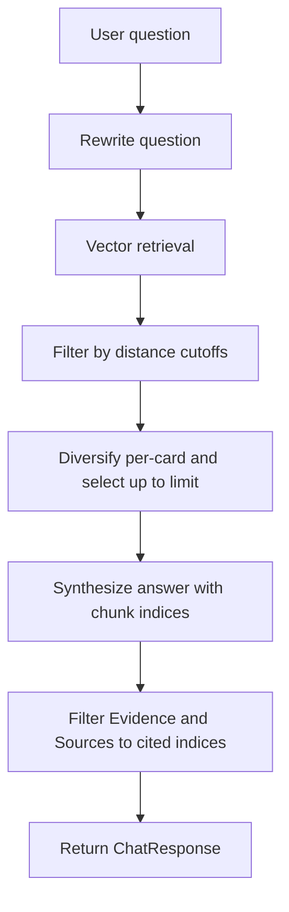

# Why every answer has exactly 25 `Sources` and `Evidence` items (current behavior)

## Root cause in code

- Retrieval defaults to **25 chunks** via [`retrieve()`](../backend/app/retrieval.py:61):
  - Signature: `def retrieve(question: str, limit: int = 25, ...)`
- The API endpoint [`chat()`](../backend/app/main.py:156) calls [`retrieve()`](../backend/app/main.py:169) **without** passing `limit`, so the default 25 is used.
- The response fields are then built **1:1 from the retrieved chunks**:
  - Evidence is created in [`chat()`](../backend/app/main.py:171)
  - Sources are created in [`chat()`](../backend/app/main.py:174)

So: `retrieved_chunks` length == `evidence` length == `sources` length, and with the default limit you see **25** every time.

## Why low-evidence items are not being cut today

There is currently:

- No explicit **evidence score** in the API contract ([`ChatResponse`](../backend/app/schemas.py:84)).
- No **distance/score threshold** applied in retrieval; pgvector `distance` is used for ordering only (plus small heuristic penalties) inside [`retrieve()`](../backend/app/retrieval.py:104).

# Target behavior (approved direction)

1) **Retrieval can return fewer than 25** by applying a hard cutoff on similarity distance.
2) **Returned `Evidence`/`Sources` should include only items actually cited/used** in the generated answer.
3) Keep the rest of retrieved chunks internal; optionally expose them only in debug mode.

# Proposed design

## A) Retrieval distance cutoffs (so retrieved list can be < 25)

Add both:

- Absolute cutoff: `RETRIEVAL_MAX_DISTANCE`
- Relative cutoff: `RETRIEVAL_DISTANCE_DELTA` meaning keep rows with `distance <= best_distance + delta`

Conservative defaults (so behavior improves out-of-the-box, but can still be tuned):

- `RETRIEVAL_MAX_DISTANCE=0.90`
- `RETRIEVAL_DISTANCE_DELTA=0.25`

Notes:

- These numbers assume **cosine distance** behavior (typical pgvector usage): smaller is more similar; relevant chunks often land well below ~1.0, while clearly irrelevant results drift toward ~1.0+.
- The new optional debug output (section C) is important: it lets us quickly tune these values based on real traffic without guessing.

Filtering order (conceptually):

1. Fetch candidates as today (keep recall high).
2. Compute `best_distance` from candidates.
3. Filter by absolute + relative rules.
4. Then run diversification + per-card cap + section penalties as today.

Implementation touchpoints:

- Extend [`RetrievedChunk`](../backend/app/retrieval.py:53) to optionally carry `distance` (or carry it in an internal tuple and only expose it in debug).
- Update [`get_settings()`](../backend/app/config.py:39) to parse the new env vars.

## B) Citation protocol (so returned lists reflect what the answer used)

Update synthesis to return structured citations:

- Number chunks in the prompt to the model, eg:
  - `[0] [card.section] content...`
  - `[1] ...`

Then require the model to return JSON with an explicit field, eg:

- `used_chunk_indices: [0, 3, 4]`

This means:

- [`synthesize_answer()`](../backend/app/llm.py:126) returns `answer` + `used_chunk_indices`.
- [`chat()`](../backend/app/main.py:156) filters `evidence` and `sources` to **only** those indices.

## C) Optional debug output (recommended for tuning thresholds)

Add an optional debug field that can be switched on via query param (eg `?debug_retrieval=1`).

Example debug payload:

- `debug_retrieval: [{card_id, section, distance}]`

This would be added to the response schema ([`ChatResponse`](../backend/app/schemas.py:84)) as an optional field.

# Test plan impact

Update/extend tests in [`test_answer_format.py`](../backend/tests/test_answer_format.py:1) to cover:

- Evidence/Sources are **not always** length 25.
- Evidence/Sources include **only cited** chunks.
- Cutoffs can reduce retrieved chunks to 0 → triggers the existing no-evidence refusal.

# Mermaid overview

