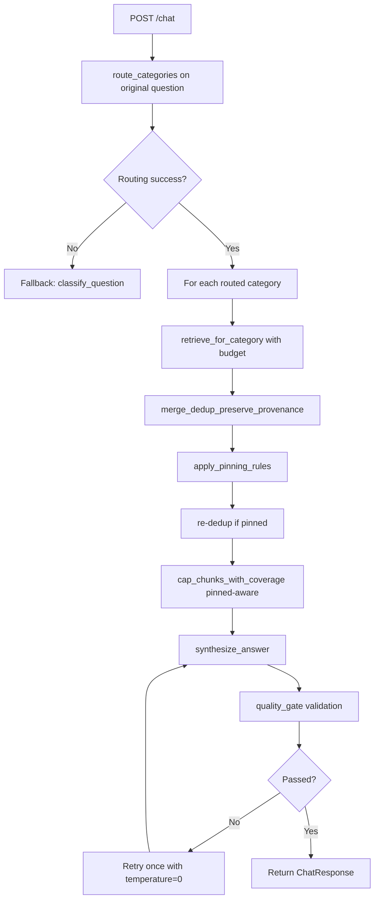
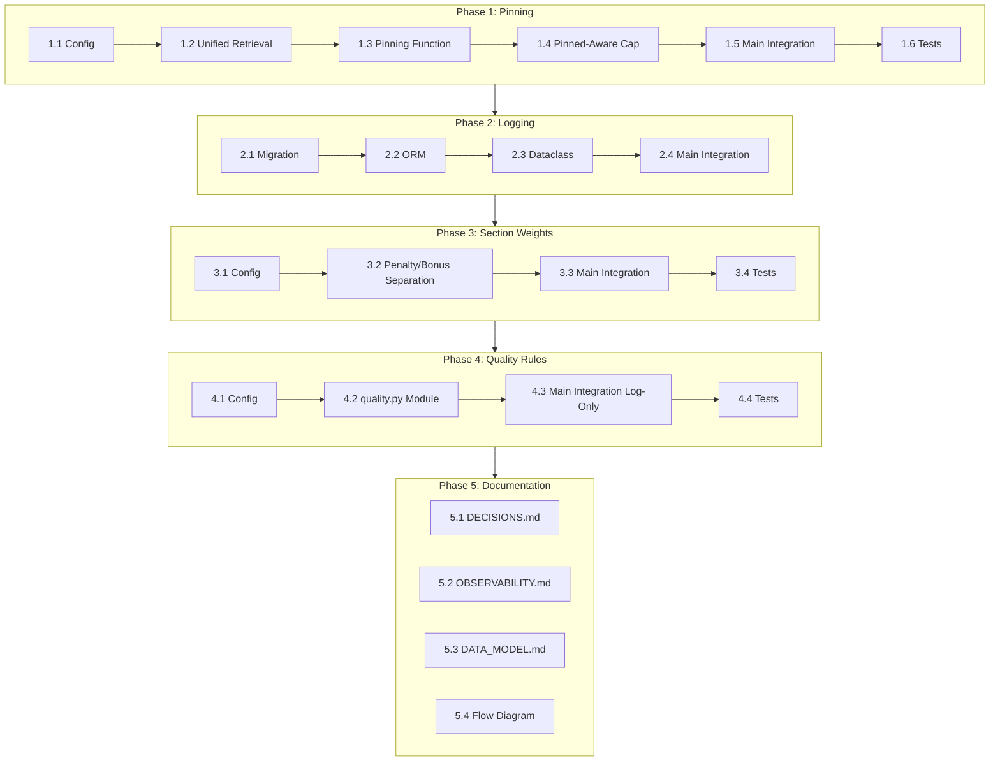

# Multi-category Routing: Remaining Implementation Plan (Revised)

## Executive Summary

This plan covers the remaining ~30% of multi-category routing implementation with a focus on:
- **General mechanisms only** - all features are category-agnostic, optional, and backward compatible
- **Incremental rollout** - each phase shipped and verified independently
- **Observability first** - logging before quality rules to enable data-driven tuning

**Already Implemented:**
- ✅ Config flags in [`backend/app/config.py`](backend/app/config.py:79-88)
- ✅ Routing contract: [`RoutedCategory`](backend/app/llm.py:104), [`RoutingResult`](backend/app/llm.py:111), [`route_categories()`](backend/app/llm.py:115)
- ✅ Schemas: [`RoutingCategory`](backend/app/schemas.py:62), [`RoutingDebug`](backend/app/schemas.py:68)
- ✅ Retrieval functions: [`retrieve_for_category()`](backend/app/retrieval.py:304), [`merge_dedup_preserve_provenance()`](backend/app/retrieval.py:571), [`cap_chunks_with_coverage()`](backend/app/retrieval.py:627)
- ✅ Main orchestration with multi-category loop in [`backend/app/main.py`](backend/app/main.py:716-759)
- ✅ Basic quality gates in [`backend/app/main.py`](backend/app/main.py:791-845)
- ✅ Logging events: `chat_routing`, `chat_retrieve_category`, `chat_retrieve_merge`, `chat_synthesis_quality_gate`

**Remaining Work (this plan):**
- Item 6: Configurable pinning rules
- Item 2: Interaction log persistence (moved earlier for diagnostics)
- Item 7: Configurable section-aware weighting
- Item 10: Configurable quality rules (log-only first)
- Documentation updates

---

## Guiding Principles

1. **Category-agnostic** - No category-specific hardcoding; all rules in configuration maps
2. **Optional** - Empty defaults mean no behavior change
3. **Backward compatible** - Feature flags OFF = identical to previous behavior
4. **Independent phases** - Each phase shipped and verified in isolation

---

## Pipeline Order (Explicit)

```
retrieve_by_category
    ↓
merge_dedup_preserve_provenance
    ↓
apply_pinning_rules
    ↓
re_dedup_after_pinning
    ↓
cap_chunks_with_coverage (pinned-aware)
    ↓
synthesize_answer
    ↓
quality_gate_validation
```

---

## Phase 1: Configurable Pinning Rules (Item 6)

### Goal
Implement a general pinning mechanism where certain cards are automatically included when specific categories are routed.

### Step 1.1: Define Pinning Rules Configuration

**File:** [`backend/app/config.py`](backend/app/config.py:1)

**Changes:**
1. Add a module-level constant for default pinning rules:
```python
# Default pinning rules: category -> list of card_ids to force-include
# Empty by default - add rules via env var or code as needed
DEFAULT_PINNING_RULES: dict[str, list[str]] = {
    # Example: "Education and formal background": ["education-facts"],
}
```

2. Add optional env var for JSON override:
```python
# In get_settings():
pinning_rules_json = os.getenv("MULTI_CATEGORY_PINNING_RULES")
if pinning_rules_json:
    try:
        multi_category_pinning_rules = json.loads(pinning_rules_json)
    except Exception:
        logger.warning("Invalid MULTI_CATEGORY_PINNING_RULES JSON, using defaults")
        multi_category_pinning_rules = DEFAULT_PINNING_RULES
else:
    multi_category_pinning_rules = DEFAULT_PINNING_RULES
```

3. Add to `Settings` dataclass:
```python
multi_category_pinning_rules: dict[str, list[str]] = field(default_factory=dict)
```

**Test Requirements:**
- Unit test: `DEFAULT_PINNING_RULES` is empty by default
- Unit test: env var override parses valid JSON
- Unit test: invalid JSON falls back to default with warning

**Dependencies:** None

---

### Step 1.2: Ensure `retrieve_for_card()` Uses Unified Ranking Logic

**File:** [`backend/app/retrieval.py`](backend/app/retrieval.py:504)

**Current Issue:** [`retrieve_for_card()`](backend/app/retrieval.py:504) bypasses:
- Section weighting
- Distance filtering (`max_distance`, `delta`)
- Low-signal section penalties

**Changes:**
1. Refactor `retrieve_for_card()` to use the same ranking logic as `retrieve_for_category()`:
```python
def retrieve_for_card(
    question: str,
    *,
    card_id: str,
    limit: int,
    origin_category: str,
    conversation_topic: str | None = None,
    section_weights: dict[str, float] | None = None,  # NEW: unified interface
) -> list[RetrievedChunk]:
    """Targeted retrieval constrained to a single knowledge card.
    
    Uses the same ranking logic as retrieve_for_category():
    - Distance filtering (max_distance, delta)
    - Section penalties for low-signal sections
    - Optional section weights for category-specific boosting
    """
    limit = max(1, int(limit))
    settings = get_settings()
    
    # ... embedding logic ...
    
    # Apply same filtering as retrieve_for_category
    best_distance = min(float(row[5]) for row in rows) if rows else 0
    max_distance = settings.retrieval_max_distance
    delta = settings.retrieval_distance_delta
    
    def _keep(row: tuple) -> bool:
        distance = float(row[5])
        if max_distance is not None and distance > max_distance:
            return False
        if delta is not None and distance > best_distance + delta:
            return False
        return True
    
    rows = [row for row in rows if _keep(row)]
    
    # Apply same section penalties and optional weights
    # ... (same logic as retrieve_for_category)
    
    return [
        RetrievedChunk(
            # ...
            pinned=True,  # Mark as pinned
        )
        for row in filtered
    ]
```

**Test Requirements:**
- Unit test: `retrieve_for_card()` applies distance filtering
- Unit test: `retrieve_for_card()` applies section penalties
- Unit test: `retrieve_for_card()` accepts and applies section_weights

**Dependencies:** None

---

### Step 1.3: Implement Pinning Logic with Pinned Flag

**File:** [`backend/app/retrieval.py`](backend/app/retrieval.py:1)

**Note:** `RetrievedChunk` already has `pinned: bool = False` field (line 50).

**Changes:**
1. Add new function `apply_pinning_rules()`:
```python
def apply_pinning_rules(
    *,
    chunks: list[RetrievedChunk],
    routed_categories: list[str],
    pinning_rules: dict[str, list[str]],
    question: str,
    conversation_topic: str | None = None,
    section_weights_by_category: dict[str, dict[str, float]] | None = None,
) -> tuple[list[RetrievedChunk], list[str]]:
    """Apply pinning rules to ensure required cards are included.
    
    IMPORTANT: Pinned chunks are retrieved using the same ranking logic
    as retrieve_for_category() to ensure consistent scoring.
    
    Returns:
        Tuple of (updated_chunks, list_of_pinned_card_ids)
    """
    pinned_cards: list[str] = []
    
    # Find which cards should be pinned based on routed categories
    required_cards: set[str] = set()
    for category in routed_categories:
        cards = pinning_rules.get(category, [])
        required_cards.update(cards)
    
    # Check which required cards are already present
    present_card_ids = {chunk.card_id for chunk in chunks}
    missing_cards = required_cards - present_card_ids
    
    if not missing_cards:
        return chunks, pinned_cards
    
    # Retrieve missing pinned cards using unified ranking logic
    for card_id in missing_cards:
        # Use first routed category that triggered this pin
        origin_category = next(
            (cat for cat in routed_categories if card_id in pinning_rules.get(cat, [])),
            routed_categories[0]
        )
        
        # Get section weights for this category (if any)
        section_weights = None
        if section_weights_by_category:
            section_weights = section_weights_by_category.get(origin_category)
        
        pinned_chunks = retrieve_for_card(
            question,
            card_id=card_id,
            limit=1,
            origin_category=origin_category,
            conversation_topic=conversation_topic,
            section_weights=section_weights,  # Unified interface
        )
        if pinned_chunks:
            chunks.extend(pinned_chunks)
            pinned_cards.append(card_id)
    
    return chunks, pinned_cards
```

**Test Requirements:**
- Unit test: no pinning when no rules match
- Unit test: pinning adds missing card when rule matches
- Unit test: no duplicate when card already present
- Unit test: pinned chunks have `pinned=True`
- Unit test: pinned chunks retrieved with section weights applied

**Dependencies:** Step 1.2

---

### Step 1.4: Make `cap_chunks_with_coverage` Pinned-Aware

**File:** [`backend/app/retrieval.py`](backend/app/retrieval.py:627)

**Current Issue:** Cap doesn't know which chunks are pinned, may evict them incorrectly.

**Changes:**
1. Update eviction logic to respect pinned flag:
```python
def cap_chunks_with_coverage(
    *,
    chunks: list[RetrievedChunk],
    routed_categories: list[str],
    max_total_chunks: int,
) -> list[RetrievedChunk]:
    """Cap evidence to `max_total_chunks` while preserving category coverage.

    Eviction rules (in order):
    1. Never evict pinned chunks (unless hard global limit exceeded)
    2. Never evict the only chunk covering a routed category
    3. Prefer evicting from over-represented categories
    4. Evict highest-distance chunks first within eligible set
    """
    max_total_chunks = max(1, int(max_total_chunks))
    if len(chunks) <= max_total_chunks:
        return chunks

    # ... existing coverage logic ...
    
    while len(working) > max_total_chunks:
        coverage = _coverage_counts(working)
        best_counts = _best_origin_counts(working)

        candidates: list[RetrievedChunk] = []
        for ch in working:
            # NEW: Skip pinned chunks unless absolutely necessary
            if ch.pinned:
                continue
            # ... existing coverage check ...
            candidates.append(ch)

        # NEW: If no candidates (all pinned), allow evicting pinned as last resort
        if not candidates:
            candidates = [ch for ch in working if ch.pinned]
            logger.warning(
                "cap_forced_pinned_eviction",
                extra={"pinned_count": len(candidates)},
            )
        
        if not candidates:
            break

        # ... existing eviction logic ...
```

**Test Requirements:**
- Unit test: pinned chunks not evicted when non-pinned available
- Unit test: pinned chunks evicted only as last resort
- Unit test: warning logged when pinned eviction occurs

**Dependencies:** Step 1.3

---

### Step 1.5: Integrate Pinning into Main Orchestration

**File:** [`backend/app/main.py`](backend/app/main.py:1)

**Changes:**
1. Import the new function:
```python
from app.retrieval import apply_pinning_rules
```

2. Insert pinning step after merge, before cap (around line 741):
```python
# After merge_dedup_preserve_provenance
merged, dedup_collisions = merge_dedup_preserve_provenance(chunks_by_category)

# Apply pinning rules
pinning_rules = getattr(settings, "multi_category_pinning_rules", {}) or {}
section_weights_all = getattr(settings, "multi_category_section_weights", {}) or {}
merged, pinned_cards = apply_pinning_rules(
    chunks=merged,
    routed_categories=[str(i.category.value) for i in routing.categories],
    pinning_rules=pinning_rules,
    question=standalone_question,
    conversation_topic=conversation_topic,
    section_weights_by_category=section_weights_all,
)

# Re-dedup after pinning (pinning may have added duplicates)
if pinned_cards:
    merged_dict: dict[str, list] = {}
    for chunk in merged:
        key = chunk.best_origin_category or "unknown"
        merged_dict.setdefault(key, []).append(chunk)
    merged, _ = merge_dedup_preserve_provenance(merged_dict)

# Then cap with coverage (pinned-aware)
chunks = cap_chunks_with_coverage(
    chunks=merged,
    routed_categories=[str(i.category.value) for i in routing.categories],
    max_total_chunks=max_total,
)
```

3. Update `chat_retrieve_merge` log to include `pinned_cards`:
```python
logger.info(
    "chat_retrieve_merge",
    extra={
        "pre_dedup_count": sum(len(v) for v in chunks_by_category.values()),
        "post_dedup_count": len(merged),
        "dedup_collisions": dedup_collisions,
        "pinned_cards": pinned_cards,
        "final_chunk_count": len(chunks),
    },
)
```

**Test Requirements:**
- Integration test: education question includes `education-facts` when rule configured
- Integration test: pinning respects max_total_chunks cap
- Integration test: pinned chunk evicted only as last resort

**Dependencies:** Steps 1.1-1.4

---

### Step 1.6: Add Regression Tests for Pinning

**File:** [`backend/tests/test_retrieval_unit.py`](backend/tests/test_retrieval_unit.py:1)

**Add tests:**
```python
def test_apply_pinning_rules_no_change_when_rules_empty() -> None:
    """Empty pinning rules = no change to results."""
    chunks = [/* ... */]
    result, pinned = retrieval.apply_pinning_rules(
        chunks=chunks,
        routed_categories=["Education and formal background"],
        pinning_rules={},  # Empty
        question="test",
    )
    assert result == chunks
    assert pinned == []


def test_retrieve_for_card_uses_distance_filtering(
    monkeypatch: pytest.MonkeyPatch,
) -> None:
    """retrieve_for_card must apply same distance filtering as retrieve_for_category."""
    # ... test that distant chunks are filtered


def test_cap_chunks_respects_pinned_flag() -> None:
    """Pinned chunks are not evicted when non-pinned available."""
    chunks = [
        RetrievedChunk(
            card_id="pinned-card",
            section="S",
            content="Pinned",
            distance=0.50,  # High distance
            pinned=True,
            origin_categories=["Education"],
            best_origin_category="Education",
        ),
        RetrievedChunk(
            card_id="non-pinned",
            section="S",
            content="Non-pinned",
            distance=0.10,  # Lower distance
            pinned=False,
            origin_categories=["Education"],
            best_origin_category="Education",
        ),
    ]
    
    capped = retrieval.cap_chunks_with_coverage(
        chunks=chunks,
        routed_categories=["Education"],
        max_total_chunks=1,
    )
    
    # Pinned should be kept despite higher distance
    assert capped[0].pinned == True
```

**Dependencies:** Steps 1.1-1.5

---

## Phase 2: Interaction Log Persistence (Item 2)

**Rationale:** Move logging before section weights and quality rules. Without telemetry, tuning is blind.

### Step 2.1: Create Database Migration

**File:** `backend/db/migrations/2026-02-13_add_multi_category_logging.sql` (new)

**Content:**
```sql
-- Add JSONB columns for multi-category routing diagnostics
-- These columns are nullable for backward compatibility

ALTER TABLE interaction_logs
ADD COLUMN IF NOT EXISTS routing JSONB DEFAULT NULL;

ALTER TABLE interaction_logs
ADD COLUMN IF NOT EXISTS retrieval_by_category JSONB DEFAULT NULL;

ALTER TABLE interaction_logs
ADD COLUMN IF NOT EXISTS quality_gate JSONB DEFAULT NULL;

COMMENT ON COLUMN interaction_logs.routing IS
'Routing result: {categories: [{category, confidence, budget}], router_fallback_used}';

COMMENT ON COLUMN interaction_logs.retrieval_by_category IS
'Per-category retrieval stats: {category: {budget, retrieved, selected}}';

COMMENT ON COLUMN interaction_logs.quality_gate IS
'Quality gate result: {passed, failure_reasons, retry_attempted}';
```

**Test Requirements:**
- Migration runs idempotently
- Columns are nullable

**Dependencies:** Phase 1 complete

---

### Step 2.2: Update ORM Model

**File:** [`backend/app/models.py`](backend/app/models.py:31)

**Changes:**
```python
class InteractionLogModel(Base):
    # ... existing columns ...
    
    # Multi-category routing diagnostics (nullable for backward compatibility)
    routing: Mapped[dict | None] = mapped_column(JSONB, nullable=True)
    retrieval_by_category: Mapped[dict | None] = mapped_column(JSONB, nullable=True)
    quality_gate: Mapped[dict | None] = mapped_column(JSONB, nullable=True)
```

**Test Requirements:**
- Model accepts new fields
- Model works without new fields (backward compatible)

**Dependencies:** Step 2.1

---

### Step 2.3: Update InteractionLog Dataclass

**File:** [`backend/app/interaction_logging.py`](backend/app/interaction_logging.py:1)

**Changes:**
```python
@dataclass
class InteractionLog:
    # ... existing fields ...
    
    # Multi-category routing diagnostics
    routing: dict | None = None
    retrieval_by_category: dict | None = None
    quality_gate: dict | None = None
```

**Test Requirements:**
- Dataclass accepts new optional fields

**Dependencies:** Step 2.2

---

### Step 2.4: Populate New Fields in Main Orchestration

**File:** [`backend/app/main.py`](backend/app/main.py:955)

**Changes:**
1. Build logging payload for multi-category:
```python
# Prepare multi-category diagnostics
routing_log = None
retrieval_by_category_log = None
quality_gate_log = None

if use_multi_category and routing is not None:
    routing_log = {
        "categories": [
            {
                "category": str(item.category.value),
                "confidence": str(item.confidence.value),
                "budget": int(item.budget or 0),
            }
            for item in routing.categories
        ],
        "router_fallback_used": router_fallback_used,
    }
    
    retrieval_by_category_log = {
        str(item.category.value): {
            "budget": int(item.budget or 0),
            "selected": len(chunks_by_category.get(str(item.category.value), [])),
        }
        for item in routing.categories
    }
    
    # Note: quality_gate_log populated after quality gate runs
```

2. Update `_log_interaction_background` signature and call.

**Test Requirements:**
- Integration test: new fields populated when multi-category enabled
- Integration test: fields are null when multi-category disabled

**Dependencies:** Steps 2.1-2.3

---

## Phase 3: Configurable Section-Aware Weighting (Item 7)

### Goal
Implement category-specific section bonuses as a configurable map, with clear separation from penalties.

### Step 3.1: Define Section Weight Configuration

**File:** [`backend/app/config.py`](backend/app/config.py:1)

**Changes:**
1. Add module-level constant:
```python
# Category-specific section weight BONUSES (not penalties)
# Positive values BOOST section ranking (subtract from distance)
# Empty by default - system behaves identically to before
DEFAULT_CATEGORY_SECTION_WEIGHTS: dict[str, dict[str, float]] = {
    # Example (not enabled by default):
    # "Education and formal background": {
    #     "degrees": 0.15,
    #     "education": 0.12,
    # },
}
```

2. Add to `Settings` dataclass:
```python
multi_category_section_weights: dict[str, dict[str, float]] = field(default_factory=dict)
```

3. Add env var parsing in `get_settings()`:
```python
section_weights_json = os.getenv("MULTI_CATEGORY_SECTION_WEIGHTS")
if section_weights_json:
    try:
        multi_category_section_weights = json.loads(section_weights_json)
    except Exception:
        logger.warning("Invalid MULTI_CATEGORY_SECTION_WEIGHTS JSON, using defaults")
        multi_category_section_weights = DEFAULT_CATEGORY_SECTION_WEIGHTS
else:
    multi_category_section_weights = DEFAULT_CATEGORY_SECTION_WEIGHTS
```

**Test Requirements:**
- Unit test: default weights are empty
- Unit test: env var override works
- Unit test: invalid JSON falls back with warning

**Dependencies:** Phase 2 complete

---

### Step 3.2: Apply Section Weights with Clear Penalty/Bonus Separation

**File:** [`backend/app/retrieval.py`](backend/app/retrieval.py:425)

**Changes:**
1. Update `_adjusted_distance()` function to clearly separate penalty and bonus:
```python
# Constants for safeguarding
MAX_SECTION_BONUS = 0.25  # Prevent weak chunks from jumping strong ones

def _adjusted_distance(row: tuple) -> tuple[float, float]:
    """
    Returns (adjusted_distance, raw_distance).
    
    Formula: adjusted = distance + penalty - bonus
    
    Where:
    - penalty >= 0 (for low-signal sections)
    - bonus >= 0 (for category-specific section weights)
    - bonus is capped at MAX_SECTION_BONUS
    """
    distance = float(row[5])
    card_id = row[0]
    section = _norm_section(row[2])
    
    # Calculate penalty (only when card has substantive alternatives)
    penalty = 0.0
    if card_has_substantive.get(card_id, False):
        penalty = section_penalty.get(section, 0.0)
        
        # Additional penalty for short substantive sections
        if section not in low_signal_sections:
            if (
                card_max_substantive_len.get(card_id, 0) >= long_section_len
                and len(row[4] or "") < short_section_len
            ):
                penalty += short_substantive_penalty
    
    # Calculate bonus (only when weights provided)
    bonus = 0.0
    if section_weights:
        raw_weight = section_weights.get(section, 0.0)
        # Cap bonus to prevent weak chunks from jumping strong ones
        bonus = min(max(0.0, raw_weight), MAX_SECTION_BONUS)
    
    adjusted = distance + penalty - bonus
    return (adjusted, distance)
```

**Test Requirements:**
- Unit test: penalty and bonus are clearly separated
- Unit test: bonus is capped at MAX_SECTION_BONUS
- Unit test: no bonus when weights empty
- Unit test: penalty still applied when weights empty

**Dependencies:** Step 3.1

---

### Step 3.3: Pass Section Weights from Main Orchestration

**File:** [`backend/app/main.py`](backend/app/main.py:716)

**Changes:**
1. Get section weights for current category:
```python
for item in routing.categories:
    budget = int(item.budget or 1)
    category_label = str(item.category.value)
    
    # Get category-specific section weights (if any)
    all_section_weights = getattr(settings, "multi_category_section_weights", {}) or {}
    category_section_weights = all_section_weights.get(category_label)
    
    selected = retrieve_for_category(
        standalone_question,
        category=category_label,
        budget=budget,
        conversation_topic=conversation_topic,
        section_weights=category_section_weights,
    )
```

**Test Requirements:**
- Integration test: weights passed correctly to retrieval
- Integration test: no weights = no behavior change

**Dependencies:** Steps 3.1, 3.2

---

### Step 3.4: Add Regression Tests for Section Weighting

**File:** [`backend/tests/test_retrieval_unit.py`](backend/tests/test_retrieval_unit.py:1)

**Add tests:**
```python
def test_section_weights_empty_no_change(
    monkeypatch: pytest.MonkeyPatch,
) -> None:
    """Empty section weights = identical ranking to before."""
    # ... setup ...
    
    chunks_no_weights = retrieval.retrieve_for_category(
        "test",
        category="Education",
        budget=2,
        section_weights=None,
    )
    
    chunks_empty_weights = retrieval.retrieve_for_category(
        "test",
        category="Education",
        budget=2,
        section_weights={},  # Empty dict
    )
    
    # Should produce identical results
    assert [c.card_id for c in chunks_no_weights] == [c.card_id for c in chunks_empty_weights]


def test_section_bonus_capped_at_max() -> None:
    """Bonus cannot exceed MAX_SECTION_BONUS."""
    # ... test that even large weight values are capped ...
```

**Dependencies:** Steps 3.1-3.3

---

## Phase 4: Configurable Quality Rules (Item 10) - Log-Only First

### Goal
Implement category-specific quality validation as a configurable system, starting in log-only mode.

### Step 4.1: Define Quality Rules Configuration

**File:** [`backend/app/config.py`](backend/app/config.py:1)

**Changes:**
1. Add module-level constant:
```python
# Category-specific quality validation rules
# Empty by default - add rules via env var as needed
DEFAULT_CATEGORY_QUALITY_RULES: dict[str, dict[str, Any]] = {
    # Example (not enabled by default):
    # "Education and formal background": {
    #     "min_tokens": ["degree", "university", "education"],
    #     "min_token_count": 1,
    # },
}
```

2. Add to `Settings`:
```python
multi_category_quality_rules: dict[str, dict[str, Any]] = field(default_factory=dict)
```

3. Add env var parsing in `get_settings()`.

**Test Requirements:**
- Unit test: default rules are empty
- Unit test: env var override works

**Dependencies:** Phase 3 complete

---

### Step 4.2: Create Separate Quality Validator Module

**File:** `backend/app/quality.py` (new)

**Content:**
```python
# Copyright 2026 Piotr Synak
# ... license header ...

"""Quality validation for synthesized answers."""

from __future__ import annotations

import logging
from dataclasses import dataclass

logger = logging.getLogger(__name__)


@dataclass(frozen=True)
class QualityValidationResult:
    """Result of quality validation."""
    passed: bool
    failure_reasons: list[str]
    category: str


def validate_answer_quality(
    *,
    answer: str,
    category: str,
    quality_rules: dict[str, dict],
) -> QualityValidationResult:
    """Validate answer against category-specific quality rules.
    
    IMPORTANT: This function only checks, never modifies.
    Retry logic is handled separately in main.py.
    
    Supported rules:
    - min_tokens: list of required tokens
    - min_token_count: minimum number of tokens that must be present
    
    Returns:
        QualityValidationResult with pass/fail status and reasons.
    """
    failures: list[str] = []
    rules = quality_rules.get(category, {})
    
    if not rules:
        return QualityValidationResult(
            passed=True,
            failure_reasons=[],
            category=category,
        )
    
    # Check min_tokens rule (simplified - no regex for v1)
    required_tokens = rules.get("min_tokens", [])
    min_count = rules.get("min_token_count", 1)
    
    if required_tokens:
        answer_lower = answer.lower()
        found = sum(
            1 for token in required_tokens
            if token.lower() in answer_lower
        )
        if found < min_count:
            failures.append(
                f"missing_category_tokens: found {found}, need {min_count}"
            )
    
    return QualityValidationResult(
        passed=len(failures) == 0,
        failure_reasons=failures,
        category=category,
    )
```

**Test Requirements:**
- Unit test: empty rules = pass
- Unit test: min_tokens pass when tokens present
- Unit test: min_tokens fail when tokens missing
- Unit test: unknown category = pass

**Dependencies:** Step 4.1

---

### Step 4.3: Integrate Quality Validator in Log-Only Mode

**File:** [`backend/app/main.py`](backend/app/main.py:1)

**Changes:**
1. Import the validator:
```python
from app.quality import validate_answer_quality
```

2. Add validation to quality gate (log-only, no retry for category rules):
```python
# Existing quality gate code
if use_multi_category and routing is not None:
    failure_reasons: list[str] = []
    refusal = "I do not have enough evidence in the provided materials."
    
    if synthesis.answer != refusal:
        # Existing checks (these CAN trigger retry)
        if not synthesis.used_chunk_indices:
            failure_reasons.append("missing_used_chunk_indices")
        if len((synthesis.answer or "").split()) < 8:
            failure_reasons.append("answer_too_short")
        
        # Category coverage check (existing, CAN trigger retry)
        if len(routing.categories) == 2 and synthesis.used_chunk_indices:
            # ... existing code ...
        
        # NEW: Category-specific quality rules (LOG-ONLY for now)
        quality_rules = getattr(settings, "multi_category_quality_rules", {}) or {}
        category_validation_failures: list[str] = []
        
        for item in routing.categories:
            category_label = str(item.category.value)
            result = validate_answer_quality(
                answer=synthesis.answer,
                category=category_label,
                quality_rules=quality_rules,
            )
            if not result.passed:
                category_validation_failures.extend(result.failure_reasons)
        
        # Log category validation failures but DON'T add to failure_reasons
        # This allows us to monitor false positives before enabling retry
        if category_validation_failures:
            logger.info(
                "chat_quality_rules_log_only",
                extra={
                    "category_validation_failures": category_validation_failures,
                    "answer_preview": synthesis.answer[:100],
                },
            )
    
    # Existing retry logic (only for core failures, not category rules)
    passed = not failure_reasons
    # ... existing retry code ...
```

**Test Requirements:**
- Integration test: category rule failures logged but don't trigger retry
- Integration test: core failures still trigger retry

**Dependencies:** Steps 4.1, 4.2

---

### Step 4.4: Add Tests for Quality Rules

**File:** `backend/tests/test_quality.py` (new)

**Add tests:**
```python
def test_validate_empty_rules_passes() -> None:
    """Empty quality rules = always pass."""
    from app.quality import validate_answer_quality
    
    result = validate_answer_quality(
        answer="Any answer",
        category="Education and formal background",
        quality_rules={},
    )
    assert result.passed


def test_validate_min_tokens_pass() -> None:
    """Pass when required tokens present."""
    from app.quality import validate_answer_quality
    
    rules = {
        "Education and formal background": {
            "min_tokens": ["degree", "university"],
            "min_token_count": 1,
        }
    }
    
    result = validate_answer_quality(
        answer="I have a degree from Stanford.",
        category="Education and formal background",
        quality_rules=rules,
    )
    assert result.passed


def test_validate_min_tokens_fail() -> None:
    """Fail when required tokens missing."""
    from app.quality import validate_answer_quality
    
    rules = {
        "Education and formal background": {
            "min_tokens": ["degree", "university"],
            "min_token_count": 2,  # Need both
        }
    }
    
    result = validate_answer_quality(
        answer="I studied at a school.",
        category="Education and formal background",
        quality_rules=rules,
    )
    assert not result.passed
    assert "missing_category_tokens" in " ".join(result.failure_reasons)


def test_validate_unknown_category_passes() -> None:
    """Unknown category = pass (no rules apply)."""
    from app.quality import validate_answer_quality
    
    rules = {
        "Education and formal background": {
            "min_tokens": ["degree"],
        }
    }
    
    result = validate_answer_quality(
        answer="I built things.",
        category="Unknown Category",
        quality_rules=rules,
    )
    assert result.passed
```

**Dependencies:** Steps 4.1-4.3

---

## Phase 5: Documentation Updates

### Step 5.1: Update DECISIONS.md

**File:** [`docs/DECISIONS.md`](docs/DECISIONS.md:1)

**Changes:**
Add new decision entry:
```markdown
## 8) Pinning, section weights, and quality rules are configurable and category-agnostic

All category-specific behaviors are defined in configuration maps, not hardcoded:
- Pinning rules: which cards to force-include per category
- Section weights: which sections to boost per category  
- Quality rules: validation requirements per category

Key principles:
- **Category-agnostic**: No category-specific code, only configuration
- **Optional**: Empty defaults = no behavior change
- **Backward compatible**: Feature flags OFF = identical to previous behavior
- **Incremental rollout**: Each phase shipped and verified independently

References: 
- [`backend/app/config.py`](backend/app/config.py:1)
- [`backend/app/retrieval.py`](backend/app/retrieval.py:1)
- [`backend/app/quality.py`](backend/app/quality.py:1)
```

**Dependencies:** Phases 1-4

---

### Step 5.2: Update OBSERVABILITY.md

**File:** [`docs/OBSERVABILITY.md`](docs/OBSERVABILITY.md:1)

**Changes:**
1. Update `chat_retrieve_merge` event to document `pinned_cards` field
2. Add `chat_quality_rules_log_only` event documentation
3. Add note about interaction log JSONB columns for multi-category diagnostics

**Dependencies:** Phases 1-4

---

### Step 5.3: Update DATA_MODEL.md

**File:** [`docs/DATA_MODEL.md`](docs/DATA_MODEL.md:1)

**Changes:**
Add documentation for new JSONB columns:
```markdown
### Multi-category routing diagnostics

- `routing` (jsonb, nullable) — routing result with categories, confidence, budgets, and fallback flag
- `retrieval_by_category` (jsonb, nullable) — per-category retrieval statistics
- `quality_gate` (jsonb, nullable) — quality gate pass/fail and retry information

These columns are nullable for backward compatibility with existing logs.
```

**Dependencies:** Phase 2

---

### Step 5.4: Add Multi-Category Flow Diagram

**File:** [`docs/ARCHITECTURE.md`](docs/ARCHITECTURE.md:1) or new file

**Add flow diagram:**
```markdown
## Multi-Category Retrieval Flow


```

**Dependencies:** Phases 1-4

---

## Implementation Order Summary

```
Phase 1: Pinning Rules (4-6 steps)
├── 1.1 Config definition
├── 1.2 Unified retrieval logic for retrieve_for_card
├── 1.3 Pinning function with pinned flag
├── 1.4 Pinned-aware cap
├── 1.5 Main integration
└── 1.6 Regression tests

Phase 2: Interaction Log (4 steps) ← Moved earlier
├── 2.1 Migration
├── 2.2 ORM model
├── 2.3 Dataclass
└── 2.4 Main integration

Phase 3: Section Weights (4 steps)
├── 3.1 Config definition
├── 3.2 Penalty/bonus separation
├── 3.3 Main integration
└── 3.4 Regression tests

Phase 4: Quality Rules (4 steps) - Log-only first
├── 4.1 Config definition
├── 4.2 Separate quality.py module
├── 4.3 Main integration (log-only)
└── 4.4 Tests

Phase 5: Documentation (4 steps)
├── 5.1 DECISIONS.md
├── 5.2 OBSERVABILITY.md
├── 5.3 DATA_MODEL.md
└── 5.4 Flow diagram
```

---

## Dependency Graph



---

## Testing Strategy

### Unit Tests
- Test each function in isolation with mocked dependencies
- Test edge cases (empty inputs, null values, invalid data)

### Integration Tests
- Test the full pipeline with real retrieval (but mocked LLM)
- Test multi-category flow end-to-end

### Regression Tests (Critical)
- **Feature flag OFF**: Behavior identical to single-category
- **Empty pinning rules**: No change to results
- **Empty section weights**: No change to ranking
- **Empty quality rules**: No validation failures

### Test File Organization

- [`backend/tests/test_retrieval_unit.py`](backend/tests/test_retrieval_unit.py:1) — Retrieval functions
- [`backend/tests/test_main_unit.py`](backend/tests/test_main_unit.py:1) — Main orchestration
- [`backend/tests/test_quality.py`](backend/tests/test_quality.py:1) — Quality validation (new)
- [`backend/tests/test_config_and_db.py`](backend/tests/test_config_and_db.py:1) — Configuration

---

## Rollout Strategy

### Each Phase Shipped Independently

1. **Phase 1 (Pinning)**: Ship with empty rules, verify no regression
2. **Phase 2 (Logging)**: Ship, verify telemetry collection
3. **Phase 3 (Section Weights)**: Ship with empty weights, verify no regression
4. **Phase 4 (Quality Rules)**: Ship in log-only mode, monitor false positives

### Feature Flags

All features controlled by:
- `MULTI_CATEGORY_RETRIEVAL_ENABLED` - Master switch
- `MULTI_CATEGORY_PINNING_RULES` - JSON config
- `MULTI_CATEGORY_SECTION_WEIGHTS` - JSON config
- `MULTI_CATEGORY_QUALITY_RULES` - JSON config

### Monitoring

Watch for:
- Failure rate per category (from quality rules logging)
- Pinning effectiveness (from `pinned_cards` in logs)
- Section weight impact (from retrieval stats)
- False positive rate before enabling retry for quality rules
