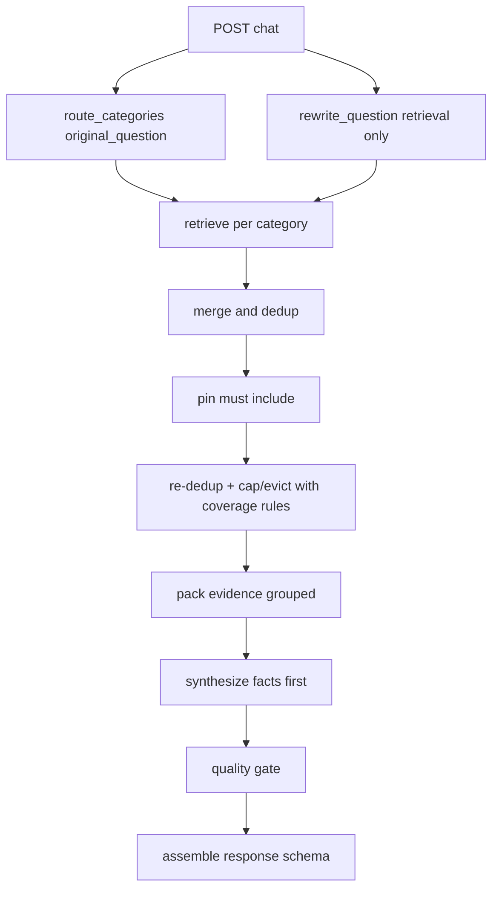

# Multi-category routing + retrieval — repo-specific implementation plan

Scope: step-by-step **implementation plan only** (no code) for adding **multi-category routing + per-category retrieval** and the downstream synthesis/observability changes, mapped to this repository’s components.

Primary code touchpoints:

- API orchestration: [`backend/app/main.py`](backend/app/main.py:373)
- Routing + synthesis prompts/contracts: [`backend/app/llm.py`](backend/app/llm.py:37)
- Retrieval + post-processing: [`backend/app/retrieval.py`](backend/app/retrieval.py:48)
- Public API schemas: [`backend/app/schemas.py`](backend/app/schemas.py:1)
- Runtime config / flags: [`backend/app/config.py`](backend/app/config.py:45)
- Interaction log model + writer: [`backend/app/models.py`](backend/app/models.py:31), [`backend/app/interaction_logging.py`](backend/app/interaction_logging.py:41)
- Request-id helpers: [`backend/app/observability.py`](backend/app/observability.py:1)
- Tests: under [`backend/tests/`](backend/tests/:1)
- Docs: under [`docs/`](docs/:1)

Non-goals (per constraints): do not propose unrelated refactors; keep changes local to routing/retrieval/synthesis contracts and their tests/docs.

---

## Decisions / defaults (explicit)

These are the defaults unless overridden by config/flags.

| Concern | Default | Notes |
|---|---:|---|
| Max routed categories | 2 | Default. Allow 3 only when the question explicitly has 3 parts (rare) and behind a flag.
| Default category budgets | 2 + 3 | Budgets are **intent-based**, not primary/secondary biased. For common two-intent questions, it still lands on 2+3.
| Default max total chunks passed to synthesis | 5 | Sweet spot for precision. Allow 6 only when router detects 3 intents, or when a category’s chunks are unusually short.
| Retrieval per-card cap semantics | Per-category per-card cap | Keep existing global setting [`Settings.retrieval_per_card_cap`](backend/app/config.py:45) but apply it per-category retrieval run by default |
| Router fallback | Existing heuristic classifier | Keep fallback path in [`chat()`](backend/app/main.py:373) when router fails |

Budget policy (deterministic server-side, intent-based):

- Budget policy is **server-side deterministic and versioned**, e.g. `intent_rules_v1` (selected via config) so behavior can be locked across releases.
- Intent rule table maps intent keywords to category keys from the allowlist (not free-text).
- Tests should snapshot a small set of example questions → expected (categories, budgets) under the active policy version.

- If router returns 1 category → budget = `max_total_chunks` (default 5) for that category.
- If router returns 2 categories → server applies an **intent rule table** to set budgets (default total 5):
  - If intent contains education or degree or background → `Education and formal background = 2`.
  - If intent contains career or experience or impact or shaped → `Hands-on engineering` (experience-like allowlist category key) `= 3`.
  - Otherwise default to 3+2, but without assuming the first category is the 3.
- If router returns 3 categories → default budgets `2+2+2` (total 6) unless one category is explicitly marked optional, in which case allow `2+3+1`.
- If router returns budgets, server clamps:
  - `len(categories) <= max_categories`
  - each budget `>=1`
  - sum(budgets) `<= max_total_chunks` (default 5, unless a 6-case applies)

---

## End-to-end target flow (at a glance)



Code anchors for the current single-category flow:

- Routing today is single category via [`python.route_category()`](backend/app/llm.py:103)
- Retrieval today is single call via [`python.retrieve()`](backend/app/retrieval.py:48)
- Synthesis today expects a flat list of evidence lines in [`python.synthesize_answer()`](backend/app/llm.py:140)
- Response assembly + evidence selection is in [`python.chat()`](backend/app/main.py:373)

---

## Contract changes (router output) — new internal type

### New internal routing output

Replace single-category router output with a multi-category output used internally by [`python.chat()`](backend/app/main.py:373).

Proposed router JSON contract (LLM output) returned by a new function [`python.route_categories()`](backend/app/llm.py:103) (or a renamed equivalent). Per correction: **do not duplicate** `categories[]` and `category_budgets{}` in the same payload.

```json
{
  "categories": [
    {
      "category": "Education and formal background",
      "confidence": "High",
      "budget": 2
    },
    {
      "category": "Hands-on engineering",
      "confidence": "Medium",
      "budget": 3
    }
  ]
}
```

Server-side rules (must be implemented even if router follows them):

- Enforce the max categories default (2) and allow 3 only under explicit conditions/flag.
- Enforce total chunks cap (default 5; allow 6 only for 3-intent or **short-chunk** cases — see the deterministic definition under feature flags).
- Normalize category strings using existing parsing in [`python._parse_category()`](backend/app/llm.py:413).
- All categories must be from a configured allowlist; unknown strings are normalized via [`python._parse_category()`](backend/app/llm.py:413) or rejected.
- If rejected, fall back to heuristic classifier and single-category.
- If JSON parsing fails or categories empty → fall back to deterministic [`python.classify_question()`](backend/app/main.py:318) and produce a single-category routing result.

Routing input (per correction):

- Route on `original_question` (the raw user question) to preserve keyword cues (e.g., education).
- Use [`python.rewrite_question()`](backend/app/llm.py:37) output only to build retrieval queries per category (and optionally to improve synthesis prompt clarity), not as the routing input.

### Optional router hints (deferred, but planned)

Router may optionally return:

- `must_include_cards`: list of card ids to force include (used for pinning)
- `preferred_sections`: map category -> list of preferred section names

If included, server must treat them as hints only and still clamp/validate.

---

## Data model / schema updates

### Public API schema (minimally invasive)

Keep the external response contract stable unless there is a product requirement to expose multi-category details.

Plan:

1) Add a new optional field to [`backend/app/schemas.py`](backend/app/schemas.py:1) for debug/observability (behind `debug_retrieval=true` or a server flag):

- `routing`: a new `RoutingResult` object containing **only** `categories: [{category, confidence, budget}]`

2) Keep existing `ChatResponse.category` as the **primary** category (first routed category) for backward compatibility.

If you decide to expose multiple categories publicly later, introduce `ChatResponse.categories: list[Category]` while keeping `category` for a deprecation window.

### Interaction log persistence (optional but recommended)

To make rollouts diagnosable across requests, extend `interaction_logs` with a small set of JSONB columns rather than many scalar columns.

Add via migration under [`backend/db/migrations/`](backend/db/migrations/:1):

- `routing` JSONB (router output after server normalization)
- `retrieval_by_category` JSONB (counts, budgets, selected)
- `quality_gate` JSONB (attempts, pass/fail, reasons)

Update:

- ORM: [`backend/app/models.py`](backend/app/models.py:31)
- Writer dataclass: [`backend/app/interaction_logging.py`](backend/app/interaction_logging.py:41)
- Docs: [`docs/DATA_MODEL.md`](docs/DATA_MODEL.md:1)

---

## Retrieval pipeline changes (where they live)

### New retrieval entrypoint(s)

Current retrieval is a single function: [`python.retrieve()`](backend/app/retrieval.py:48).

Plan to add one of:

- `retrieve_for_category(question, category, budget, conversation_topic, preferred_sections, must_include_cards)`
- or `retrieve_multi(question, routing_result, conversation_topic)`

Keep core SQL query logic in [`backend/app/retrieval.py`](backend/app/retrieval.py:48) but factor post-processing so it can run per-category with category-specific section weighting.

### Per-category retrieval loop

In [`python.chat()`](backend/app/main.py:373):

- Call router → obtain `RoutingResult`
- For each category in priority order:
  - call retrieval with `limit = category_budget * oversample_factor`
    - Default `oversample_factor` should be category-specific:
      - Education and formal background: **8–12×** (default 10×) to improve recall across degrees/institutions/certifications.
      - Hands-on engineering / experience-like categories: **6–8×** (default 7×) because these tend to have more plentiful relevant chunks.
  - apply category-specific section weighting
  - apply per-card cap semantics (per-category)
  - return top `budget` chunks for that category

### Merge + dedup

After per-category retrieval, merge into one list capped to `max_total_chunks`.

Pinning ordering note (explicit): pinning **inserts required chunks**, then the pipeline re-runs **dedup + cap/eviction** with category-coverage rules. Pinning itself is subject to dedup (i.e., do not add a duplicate of an already-selected chunk).

Dedup requirements (per correction: avoid content-hash-only as the “truth”):

- Preferred dedup key (if available from ingestion/DB): `chunk_id` (stable) or `(card_id, section, chunk_index)`.
- Fallback dedup key: `(card_id, section, sha256(normalized_content))`.
  - Normalize content before hashing (trim + collapse whitespace) so formatting-only changes don’t break dedup.
- Preserve the best (lowest adjusted distance) instance.
- Preserve provenance metadata: `origin_categories: [..]` and `best_origin_category`.

Metadata shape added to retrieved chunks (internal-only, not necessarily API-exposed):

```json
{
  "card_id": "education-facts",
  "section": "Degrees",
  "distance": 0.21,
  "content": "...",
  "origin_categories": ["Education and formal background"],
  "origin_category_rank": {"Education and formal background": 1},
  "budget_tag": "primary"
}
```

Implementation location: best in [`backend/app/retrieval.py`](backend/app/retrieval.py:48) (merge utilities) so tests can cover it without involving FastAPI.

---

## Must-include / pinning for `education-facts`

Requirement: critical education facts must be present when the question is education-related, and optionally when multi-category routing includes education.

Note: pinning rules are **category-specific** and may expand later (e.g. pinning for publications via a `publications-facts` / `research-key-publications` rule).

Plan:

1) Define pinning rules in retrieval layer to avoid contaminating synthesis with irrelevant pinned evidence:

- If any routed category is `Education and formal background` (or question keyword heuristic indicates education), ensure at least 1 chunk from card `education-facts` is included.

2) How to pick pinned chunk(s):

- Prefer substantive sections (non-Title) using existing low-signal logic in [`backend/app/retrieval.py`](backend/app/retrieval.py:147).
- If retrieval results already include `education-facts`, do nothing.
- Else perform a targeted retrieval pass constrained to `card_id='education-facts'` if possible (SQL WHERE clause) and take the best chunk.

3) Enforce pinning **before final cap**: pinned chunk consumes budget and may evict the weakest non-pinned chunk.
   Pinned chunks count toward the `max_total_chunks` cap.

Clarification (ordering): implement pinning as “insert required chunk(s)”, then re-run **dedup + cap/eviction** with category-coverage rules. Pinning itself is subject to dedup (avoid duplicates).

If pinning causes a category to lose coverage, eviction must be re-run.

Optional future principle (v1.1): when category coverage is required, ensure **minimum 1 pinned chunk per required category** (when a suitable pinned source exists).

Eviction priority rule (explicit):

- Never evict the **only** chunk representing a routed category when category coverage is required.
- Evict weakest non-pinned chunk from the **over-represented** category first.

Tests should anchor on existing file [`backend/tests/test_retrieval_fallback_education_sources.py`](backend/tests/test_retrieval_fallback_education_sources.py:1).

---

## Section-aware weighting (category-specific)

Retrieval already deprioritizes low-signal sections (Title/Category/Tech stack) via penalties in [`backend/app/retrieval.py`](backend/app/retrieval.py:181).

Extend with a category-aware weighting table:

- Add a map: `CATEGORY_SECTION_BONUS[Category] -> {section_norm: bonus}`
- Apply as an additional adjustment inside the per-category selection ranking.

Examples:

- Education category: boost `degrees`, `education`, `timeline`, `certifications` (as present in the knowledge cards)
- Research category: boost `publications`, `patents`, `research`

Also add light negative weighting where it improves precision:

- For Education category, apply a small penalty to `scale and impact`-like sections (avoid pulling in production metrics into education-only answers).

Guardrails:

- Keep bonuses modest (tie-breakers), similar magnitude to current penalties (~0.1–0.3) to avoid overriding similarity.
- Only apply when a card has multiple sections available (same pattern as existing `card_has_substantive` gate).

---

## Evidence packing for synthesis prompts (grouped)

Today synthesis prompt uses flat evidence lines built in [`python.synthesize_answer()`](backend/app/llm.py:140).

New packing format: group evidence by category, but maintain **global stable indices** so the model can return `used_chunk_indices` against the final merged list.

Proposed prompt evidence block:

```text
Evidence groups (global indices):

Category: Education and formal background | budget 2 | provided 2
[0] [education-facts.Degrees] ...
[1] [education-overview.Summary] ...

Category: Hands-on engineering | budget 3 | provided 3
[2] [project-onprem-rag-platform.Impact] ...
[3] [experience-observability-and-ops.Operational outcomes] ...
[4] [project-decreen-knowledge-graph-onboarding.Role] ...
```

Also include provenance hints per chunk (optional):

- `origin_categories` if a chunk is shared/deduped.

---

## Synthesis prompt updates: facts-first answer format + quality gates

### Facts-first output (minimal surface-area)

Per correction: do **not** add a new top-level JSON field (like `facts`) in v1 unless needed.

Plan:

- Keep synthesis output fields unchanged: `answer`, `why_this_matters`, `confidence`, `confidence_reason`, `used_chunk_indices` in [`python.synthesize_answer()`](backend/app/llm.py:140).
- Update the synthesis prompt so `answer` itself is **facts-first**, e.g. starts with 2–6 short bullet-like facts, then a 1–2 sentence direct synthesis.
- Keep `formatted_answer` builder in [`python.format_answer()`](backend/app/main.py:338) unchanged unless tests reveal formatting mismatches.

### Quality gates + retry (robust, minimal heuristics)

Add a post-synthesis validator (server-side) to detect non-compliant outputs and trigger a single retry with a stricter prompt.

Quality gates (minimum set):

- Gate 1: if answer is not refusal, `used_chunk_indices` must be non-empty (already required).
- Gate 2: non-generic / non-trivial: reuse/extend existing “too short” guardrail in [`backend/app/llm.py`](backend/app/llm.py:321).
- Gate 3: category coverage: for 2 routed categories, used chunks must include both `origin_category` values unless secondary retrieval returned 0 chunks.
- Gate 4 (category-specific token checks, stable):
  - For Education answers: answer must contain at least 2 “education tokens” (degree/institution keywords), otherwise retry.
  - For Production/Experience answers: answer must contain at least **2 named examples**, defined in a non-brittle way as:
    - at least 2 bullet points that start with a domain/system label (e.g. `Decreen:`, `On‑prem RAG platform:`) **and**
    - each includes at least one role/action verb such as `designed`, `built`, `led`, `shipped`.

Retry behavior:

- Retry once with:
  - `temperature=0`
  - explicit instruction to produce facts-first bullets
  - explicit instruction to cite indices in `used_chunk_indices`
- If retry fails → fall back to deterministic synthesis [`python._fallback_synthesis()`](backend/app/llm.py:373) or refusal (depending on evidence quality).

---

## Rewrite vs routing (explicit sequencing)

Per correction: avoid routing on rewritten text.

- Routing runs on `original_question`.
- Rewrite runs only to produce retrieval queries per category (it may remove or alter keywords that the router should see).

---

## Logging / observability (points + fields)

Use structured logs already present in [`python.chat()`](backend/app/main.py:373) (`chat_stage`, etc.). Extend with minimal additional events:

1) Routing

- Event: `chat_routing`
- Fields:
  - `request_id` (implicit via request-id context)
  - `categories` (router payload; budgets are logged embedded per category, e.g. `[{category, confidence, budget}]` or `[{category, budget}]` — no `category_budgets{}` map)
  - `max_categories`, `max_total_chunks`
  - `router_fallback_used` (bool)

2) Retrieval per category

- Event: `chat_retrieve_category`
- Fields:
  - `category`
  - `budget`
  - `retrieved_count_raw`
  - `selected_count`
  - `per_card_cap`
  - `section_weighting_enabled`

3) Merge/dedup

- Event: `chat_retrieve_merge`
- Fields:
  - `pre_dedup_count`
  - `post_dedup_count`
  - `dedup_collisions`
  - `pinned_cards` (list)
  - `final_chunk_count`

4) Synthesis quality gates

- Event: `chat_synthesis_quality_gate`
- Fields:
  - `passed` (bool)
  - `failure_reasons` (list)
  - `retry_attempted` (bool)
  - `used_chunk_indices_count`
  - `used_categories` (derived from used chunks)

Persistence (if adopted): store `routing`, `retrieval_by_category`, `quality_gate` JSONB in `interaction_logs` (see data model section).

---

## Feature flag + rollout strategy

Add config flags in [`backend/app/config.py`](backend/app/config.py:45):

- `MULTI_CATEGORY_RETRIEVAL_ENABLED` default false
- `MULTI_CATEGORY_MAX_CATEGORIES` default 2
- `MULTI_CATEGORY_MAX_TOTAL_CHUNKS` default 5
- `MULTI_CATEGORY_ALLOW_SIX_CHUNKS` default false (set true only for 3-intent or short-chunk cases)
  - Define “short chunk” deterministically and testably as: `median_content_length_chars < 350` across the **selected** chunks (pre-cap) for the request, computed after per-category selection and before final merge cap. When this condition holds, allow a 6-chunk cap.
- `MULTI_CATEGORY_INTENT_BUDGET_POLICY` default `intent_rules_v1` (so tests can lock behavior)

Rollout plan:

1) Ship with flag OFF: current behavior unchanged.
2) Enable in dev/stage.
3) In prod, enable by sampling (A/B) based on stable hash of `request_id` from [`python.get_request_id()`](backend/app/observability.py:27):

- `enabled = flag_on and (hash(request_id) % 100 < rollout_percent)`

Metrics to watch (from logs or interaction_logs JSONB):

- refusal rate (`chat_refusal_no_evidence` already exists)
- average evidence count
- quality-gate failure rate + retry rate
- answer length distribution

---

## Explicit test plan (repo files)

Add/adjust unit tests to cover routing contract, retrieval budgeting, dedup, pinning, evidence packing, and answer format/quality gates.

### Routing output parsing + clamping

Target file: [`backend/tests/test_llm_unit.py`](backend/tests/test_llm_unit.py:1)

- Router returns 2 categories with budgets → server clamps to max categories and max total.
- Router returns invalid JSON → fallback classifier used.
- Router returns unknown category string → normalized via [`python._parse_category()`](backend/app/llm.py:413).
- Regression: router sees `original_question`, and per-category rewrite happens only after routing (router→rewrite separation).

### Retrieval per-category + merge/dedup

Target file: [`backend/tests/test_retrieval_unit.py`](backend/tests/test_retrieval_unit.py:1)

- Given synthetic candidate rows, ensure per-category selection returns <= budget.
- Merge dedup removes duplicate chunk keys but retains provenance (`origin_categories`).
- Per-category per-card cap is enforced within each category run.

### Must-include/pinning for education facts

Target file: [`backend/tests/test_retrieval_fallback_education_sources.py`](backend/tests/test_retrieval_fallback_education_sources.py:1)

- If routing includes education, final merged evidence contains at least one chunk from `education-facts`.
- Pinning consumes budget and evicts the weakest chunk when at cap.

### API orchestration wiring

Target file: [`backend/tests/test_main_unit.py`](backend/tests/test_main_unit.py:1)

- When flag OFF → exactly one retrieval call path (existing behavior).
- When flag ON → retrieval called per category; merged list length respects max.
- Response still conforms to [`backend/app/schemas.py`](backend/app/schemas.py:92).

### Answer formatting + facts-first structure

Target file: [`backend/tests/test_answer_format.py`](backend/tests/test_answer_format.py:1)

- `ChatResponse.answer` begins with a Facts block (when non-refusal).
- `formatted_answer` still contains mandatory sections from [`python.format_answer()`](backend/app/main.py:338).

### Quality gates + retry behavior

Target file: add new tests in [`backend/tests/test_answer_format.py`](backend/tests/test_answer_format.py:1) or a new focused test file under [`backend/tests/`](backend/tests/:1)

- Synthesis returns generic/too-short answer → quality gate triggers retry.
- Retry failure → deterministic fallback or refusal; never returns ungrounded answer.

---

## Numbered implementation plan mapping (0–12)

This section maps the required work items (0–12) onto repository components.

### 0) Confirm target behavior and limits

- Implement defaults + clamps in [`backend/app/config.py`](backend/app/config.py:45) and enforce in [`python.chat()`](backend/app/main.py:373): default `max_total_chunks=5`, intent-based budgets.
- Add doc entry in [`docs/DECISIONS.md`](docs/DECISIONS.md:1) describing max categories and chunk budgets.

### 1) Update routing contract (micro-LLM)

- Replace/augment [`python.route_category()`](backend/app/llm.py:103) with multi-category routing returning **only** `categories: [{category, confidence, budget}]`.
- Ensure fallback path in [`python.chat()`](backend/app/main.py:373) builds a single-category `RoutingResult`.

### 2) Extend data schemas/models

- Add `RoutingResult` and optional `ChatResponse.routing` in [`backend/app/schemas.py`](backend/app/schemas.py:1).
- (Optional) Add interaction_logs JSONB fields + migration + docs: [`backend/app/models.py`](backend/app/models.py:31), [`backend/app/interaction_logging.py`](backend/app/interaction_logging.py:41), [`docs/DATA_MODEL.md`](docs/DATA_MODEL.md:1).

### 3) Update pipeline: retrieval per category with per-category budget

- Orchestrate per-category retrieval loop in [`python.chat()`](backend/app/main.py:373).
- Add retrieval helper entrypoint(s) in [`backend/app/retrieval.py`](backend/app/retrieval.py:48).

### 4) Merge results + dedup preserving origin metadata

- Implement merge/dedup utilities in [`backend/app/retrieval.py`](backend/app/retrieval.py:48).
- Ensure `origin_categories` metadata is attached for synthesis packing.

### 5) Decide and implement per-card cap semantics

- Default: apply [`Settings.retrieval_per_card_cap`](backend/app/config.py:45) per category run.
- Add tests in [`backend/tests/test_retrieval_unit.py`](backend/tests/test_retrieval_unit.py:1).

### 6) Must-include/pinning for critical education facts card(s)

- Add pinning rule for `education-facts` in retrieval layer; verify via [`backend/tests/test_retrieval_fallback_education_sources.py`](backend/tests/test_retrieval_fallback_education_sources.py:1).

### 7) Section-aware weighting/filtering per category

- Extend distance adjustment logic in [`backend/app/retrieval.py`](backend/app/retrieval.py:181) with category-specific bonuses.
- Tests: [`backend/tests/test_retrieval_unit.py`](backend/tests/test_retrieval_unit.py:1).

### 8) Evidence packing format for synthesis prompts

- Update evidence builder in [`python.synthesize_answer()`](backend/app/llm.py:140) to group by category while keeping global indices.
- Ensure `used_chunk_indices` still maps to the merged list.

### 9) Facts-first answer format and contract

- Update synthesis prompt in [`python.synthesize_answer()`](backend/app/llm.py:140) so `answer` is facts-first (bullets + short synthesis) without adding new JSON fields.
- Update formatting expectations in [`backend/tests/test_answer_format.py`](backend/tests/test_answer_format.py:1).

### 10) Quality gates + retry

- Add server-side validator + retry loop around [`python.synthesize_answer()`](backend/app/llm.py:140) (likely best placed in [`backend/app/main.py`](backend/app/main.py:373) to keep LLM module pure).
- Tests in [`backend/tests/test_answer_format.py`](backend/tests/test_answer_format.py:1).

### 11) Logging points + fields

- Add structured events in [`backend/app/main.py`](backend/app/main.py:373).
- (Optional) persist JSONB fields via interaction_logs updates (see schema section).
- Update observability docs: [`docs/OBSERVABILITY.md`](docs/OBSERVABILITY.md:1).

### 12) Feature flag and rollout strategy

- Add flags in [`backend/app/config.py`](backend/app/config.py:45).
- Implement server-side sampling in [`backend/app/main.py`](backend/app/main.py:373) using request id from [`backend/app/observability.py`](backend/app/observability.py:1).
- Add tests for flag off/on in [`backend/tests/test_main_unit.py`](backend/tests/test_main_unit.py:1).

